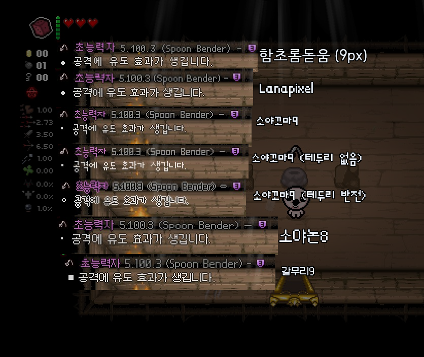
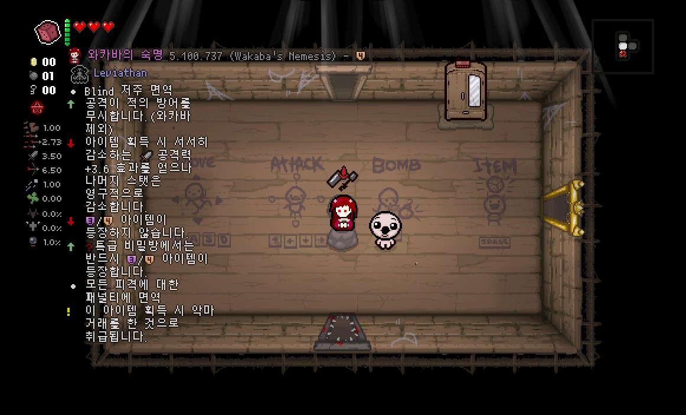
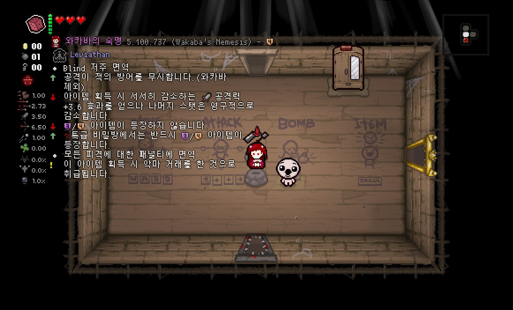

이 페이지는 Mod Config Menu에 접근할 수 없거나 사용하기 힘들 경우 eid_config.lua를 직접 수정해야 될 때를 위한 페이지입니다. Mod Config Menu로 옵션을 설정하고자 할 경우 각 옵션별 대응 옵션을 찾아서 수정하면 됩니다.

## General

### Language
!!! note "" 
    대응 옵션 : EID > General > **Language**
언어를 설정합니다. 기본값은  ```"auto"```이며 아이템 설명모드가 지원하는 언어 중 하나를 선택할 수 있습니다.  
기본값 : "auto"

| 값 | 언어 | 번역 작업자 |
| ------------ | ------------- | ------------- |
| "auto" | **게임 언어 자동 매칭**(리펜턴스 한정) |  |
| "en_us" | **영어**(English) | Wofsauge |
| "en_us_detailed" | **영어, 설명 자세하게**(English Detailed) | Wofsauge |
| "fr" | **프랑스어**(French) | Nicolas Delvaux |
| "pl" | **폴란드어**(Polish) | Rickyy |
| "spa" | **에스파냐어**(Spanish) | Lidia Arroyo Purroy |
| "pt" | **포르투갈어**(Portuguese) | Marcelino Cruz |
| "pt_br" | **브라질어**(Brazilian Portuguese) | Marcelino Cruz |
| "ru" | **러시어아**(Russian) | hell2pay, fly_6 |
| "it" | **이탈리아어**(Italian) | Denkishi, 2G |
| "bul" | **불가리아어**(Bulgarian) | Gothika_47 |
| "tr_tr" | **터키어**(Turkish) | Mert Dutal |
| "ko_kr" | **한국어**(Korean) | Blackcreamtea, 미카 |
| "zh_cn" | **중국어**(Chinese) | Xheepey87, frto027 |
| "ja_jp" | **일본어**(Japanese) | prefab |
| "cs_cz" | **체코어**(Czech) | domcizzz |

### TranslateItemName
!!! note "" 
    대응 옵션 : EID > General > **Name Language**

아이템 이름을 어떻게 출력할지 설정합니다.  
기본값 : 2

| 값 | 적용 방식 |
| ------------ | ------------- |
| 1 | **영어**(English) |
| 2 | **현재 언어**(Current) |
| 3 | **현재 언어 + 영어**(Current + English) |

### FontType
!!! note "" 
    대응 옵션 : EID > Visuals > **Font Type**

폰트 종류를 설정합니다. 언어별로 설정할 수 있는 폰트가 다르기 때문에 반드시 Mod Config Menu를 통해 설정하는 것을 권장합니다. 한국어는 아래의 폰트 중 하나를 선택할 수 있습니다.  



| 값 | 적용 방식 |
| ------------ | ------------- |
| "korean_hcrdotum" | **함초롬돋움** |
| "korean_lanapixel" | **Lanapixel** |
| "korean_soyakkoma" | **소야꼬마9** |
| "korean_soyakkoma_borderless" | **소야꼬마9**(테두리 없음) |
| "korean_soyakkoma_inverted" | **소야꼬마9**(글자색 반전) |
| "korean_soyanon" | **소야논8** |
| "korean_galmoori9" | **갈무리9** |
| "korean_galmoori11" | **갈무리11** |

### Size
!!! note "" 
    대응 옵션 : EID > Visuals > **Text Size**

텍스트박스의 크기 비율을 설정합니다.  
기본값 : 1  
!!! warning ""
    **주의** : 0.5배 혹은 정수 배율이 아닌 경우 폰트가 깨져서 나올 수 있습니다.

### SizeHotkey
!!! note "" 
    대응 옵션 : EID > Visuals > **Toggle Scale(Keyboard)**

텍스트박스의 크기 비율을 설정하는 바로가기 키를 설정합니다. (키보드 전용)  
해당 키를 누르면 크기 비율을 0.5, 1.0, 1.5배 순서로 적용되며 꾹 눌렀을 경우 세부 배율이 조절됩니다.
설정값은 [이 링크](https://wofsauge.github.io/IsaacDocs/rep/enums/Keyboard.html)에서 확인할 수 있습니다.  
기본값 : -1 (없음)

### Transparency
!!! note "" 
    대응 옵션 : EID > Visuals > **Transparency**

글자의 불투명도를 설정합니다.  
값 : 0 ~ 1  
기본값 : 0.75   

### HUDOffset

HUD 기준점을 설정합니다. (애프터버스 + 전용)  
기본값 : 10

### XPosition
!!! note "" 
    대응 옵션 : EID > General > **Position X**

텍스트박스의 X좌표 위치를 설정합니다. 리펜턴스 버전일 경우 HUD 위치에 따라 자동으로 조정됩니다.  
기본값 : 60

### YPosition
!!! note "" 
    대응 옵션 : EID > General > **Position Y**

텍스트박스의 Y좌표 위치를 설정합니다. 리펜턴스 버전일 경우 HUD 위치에 따라 자동으로 조정됩니다.  
기본값 : 45

### LineHeight
!!! note "" 
    대응 옵션 : EID > General > **Line Height**

줄 간 간격을 설정합니다. 기본 설정은 폰트마다 다릅니다.  
기본값 : 11(기본 폰트)

### TextboxWidth
!!! note "" 
    대응 옵션 : EID > General > **Textbox Width**

텍스트박스의 넓이를 설정합니다. 기본 설정은 폰트마다 다릅니다.  
기본값 : 130(한글 150)

!!! note "예시" 
    === "Boxwidth 100"
        
    === "Boxwidth 200"
        

### MaxDistance
!!! note "" 
    대응 옵션 : EID > General > **Max Distance**

아이템이 인식되는 범위를 설정합니다.  
기본값 : 5

### Indicator
!!! note "" 
    대응 옵션 : EID > General > **Indicator**

설명 출력중인 아이템의 표시방법을 설정합니다. (아래 그림 참조)  

기본값 : "none"  


| 값 | 적용 방식 |
| ------------ | ------------- |
| "arrow" | **화살표** |
| "blink" | **깜빡임** |
| "border" | **테두리 깜빡임** |
| "highlight" | **테두리** |
| "none" | **없음** | 


### HideKey
!!! note "" 
    대응 옵션 : EID > General > **Toggle(Keyboard)**

설명을 켜고 끌 수 있는 버튼을 설정합니다. (키보드 전용)  
설정값은 [이 링크](https://wofsauge.github.io/IsaacDocs/rep/enums/Keyboard.html)에서 확인할 수 있습니다.  
기본값 : Keyboard.KEY_F2 (++f2++키)

### HideButton
!!! note "" 
    대응 옵션 : EID > General > **Toggle(Controller)**

설명을 켜고 끌 수 있는 버튼을 설정합니다. (컨트롤러 전용)  
설정값은 [이 링크](https://github.com/wofsauge/External-Item-Descriptions/blob/master/mod_config_menu.lua#L1)에서 확인할 수 있습니다. 값 설정은 'Controller.STICK_LEFT'와 같이 설정합니다.  
기본값 : -1 (없음)

### InitiallyHidden
!!! note "" 
    대응 옵션 : EID > General > **Is Initially Hidden**

아이작의 번제 게임 시작 시 설명 모드를 숨기게 할지 설정합니다.  
기본값 : false

### HideInBattle
!!! note "" 
    대응 옵션 : EID > General > **Hide in Battle**

전투 중에 아이템 설명을 숨길지 설정합니다.  
기본값 : false

### RefreshRate
!!! note "" 
    대응 옵션 : EID > Display > **Description Refresh Rate**

설명모드의 설명 새로고침 주기를 설정합니다.(초당 n회 새로고침)   
숫자가 높을수록 설명모드가 더 빠르게 반응하나 게임 성능이 하락할 수 있습니다.   
값 : 1, 2, 3, 4, 5, 6, 10, 12, 15, 20, 30, 60
기본값 : 30

### DisableObstructionOnFlight
!!! note "" 
    대응 옵션 : EID > General > **Show again when having flight**

비행 능력이 생길 때 갈 수 없는 장소에 있었던 카드나 알약의 설명을 출력할지 설정합니다.  
기본값 : false

### DisableAchievementCheck
!!! note "" 
    대응 옵션 : EID > General > **Start of Run Warning**

도전과제 해금이 불가능할하거나 알트 카인 플레이 시 아이템을 추가하거나 배열을 바꾸는 모드를 사용하는 경우 경고문을 숨길지 설정합니다.  
기본값 : false

## Co-op / Multiple Descriptions

### CoopDescriptions

!!! note "" 
    대응 옵션 : EID > Display > **Co-op Player Descriptions**

멀티 플레이 시 모든 플레이어의 인식 범위에 있는 아이템의 설명을 보여줍니다.   
2개 이상의 아이템의 설명이 동시에 보여질 경우 2번째 아이템부터는 아이템 바로 밑에서 설명이 표시됩니다.  
기본값 : true

### PairedPlayerDescriptions

!!! note "" 
    대응 옵션 : EID > Display > **Paired Player Descriptions**

2개의 캐릭터를 한 플레이어가 동시에 조종할 경우 연결된 플레이어(Esau, Tainted Forgotten)가 인식 범위에 있어도 아이템의 설명을 보여줍니다.  
기본값 : false

### DisplayAllNearby

!!! note "" 
    대응 옵션 : EID > General > **Display All Objects In Range**

인식 범위 안에 있는 모든 설명을 출렧합니다.   
주의: 설명이 정상적으로 출력되지 않거나 가려질 수 있습니다.   
기본값 : false

### MaxDescriptionsToDisplay

!!! note "" 
    대응 옵션 : EID > General > **Max Descriptions to Display**

출력되는 최대 설명의 개수를 설정합니다. (일부 상황에만 적용)
기본값 : 99

## Display Modes

### DisplayMode
!!! note "" 
    대응 옵션 : EID > Visuals > **Display mode**

아이템 설명을 어디에 표시할지 설정합니다.  
기본값 : "default"

| 값 | 적용 방식 |
| ------------ | ------------- |
| "default" | **기본값** : 모든 아이템의 설명이 고정된 위치에 표시됩니다. |
| "local" | **아이템 위치** 애프터버스의 아이템 설명 모드와 같이 아이템의 설명이 각 아이템 주변에 표시됩니다. |

### LocalModeSize
!!! note "" 
    대응 옵션 : EID > Visuals > **Text Size(local mode)**

아이템 설명을 아이템 주변에 표시할 때 크기 비율을 설정합니다.  
기본값 : 0.5  

### LocalModeCentered
!!! note "" 
    대응 옵션 : EID > Visuals > **Local mode centered**

아이템 설명을 아이템 주변에 표시할 때 가운데 정렬을 할지 설정합니다.  
기본값 : true  

## Icons

### MarkupSize
!!! note "" 
    대응 옵션 : EID > Visuals > **Markup Icon Size**

아이콘의 크기를 설정합니다.   
값 : "default", "big", "small"
기본값 : default  

### StatChangeIcons
!!! note "" 
    대응 옵션 : EID > Visuals > **Stat Change Icons**

스탯 증감 라인의 아이콘을 보여줍니다.  
기본값 : false  

### StatAndPickupBulletpoints
!!! note "" 
    대응 옵션 : EID > Visuals > **Stat/Pickup Bulletpoint Icons**

각 줄의 라인 말머리표 대신 아이콘을 보여주는 것을 허용합니다.  
기본값 : true  

## Curse

### DisableOnCurse
!!! note "" 
    대응 옵션 : EID > General > **Show on "Curse of Blind"**

아이템이 보이지 않는 저주(블라인드) 상태에서 아이템 설명을 출력할지 설정합니다.  
기본값 : false  

### DisableOnAltPath
!!! note "" 
    대응 옵션 : EID > General > **Show hidden alt-Path Item**

알트 스테이지 또는 일반 스테이지에서 보이지 않는 아이템의 설명을 출력할지 설정합니다. (리펜턴스 전용)  
기본값 : false  

### DisableOnAprilFoolsChallenge
!!! note "" 
    대응 옵션 : EID > General > **Show on April Fools challenge**

April's Fool 챌린지에서 아이템의 설명을 출력할지 설정합니다.  
기본값 : false  

## Item Names


### ShowItemName
!!! note "" 
    대응 옵션 : EID > Visuals > **Display Item Name**

아이템, 카드, 알약의 이름을 보여줄지 설정합니다.  
기본값 : true  

### ShowItemType
!!! note "" 
    대응 옵션 : EID > Visuals > **Display Item Type**

액티브 아이템, 패밀리어 등 아이템의 형식을 보여줄지 설정합니다.  
기본값 : true  

### ShowItemIcon
!!! note "" 
    대응 옵션 : EID > Visuals > **Display Item Icon**

아이템, 카드, 알약의 아이콘을 보여줄지 설정합니다.  
기본값 : true  

### DisplayItemInfo
!!! note "" 
    대응 옵션 : EID > Display > **Collectible Infos**

아이템의 설명을 보여줄지 설정합니다.  
기본값 : true  

### DisplayTrinketInfo
!!! note "" 
    대응 옵션 : EID > Display > **Trinket Infos**

장신구의 설명을 보여줄지 설정합니다.  
기본값 : true  

### ItemNameColor
!!! note "" 
    대응 옵션 : EID > Color > **Names**

아이템 이름 텍스트의 색상을 설정합니다.  
텍스트 색상은 "eid_data.lua" 파일에서 확인할 수 있습니다.  
기본값 : "ColorEIDObjName"  

### ShowObjectID
!!! note "" 
    대응 옵션 : EID > Visuals > **Display Object ID**

아이템, 카드, 알약의 이름 옆의 각 엔티티의 번호(예시 : 5.100.331)를 보여줄지 설정합니다.  
기본값 : false  

### ShowQuality
!!! note "" 
    대응 옵션 : EID > Visuals > **Display Quality Info**

아이템의 퀄리티를 보여줄지 설정합니다. (리펜턴스 전용)  
기본값 : true  

### ModIndicatorDisplay
!!! note "" 
    대응 옵션 : EID > Visuals > **Mod indicator displayed for:**

모드 아이템의 출신 모드를 보여줍니다.
기본값 : "None"  

### ModIndicatorTextColor
!!! note "" 
    대응 옵션 : EID > Color > **Mod Indicator**

아이템 이름 텍스트의 색상을 설정합니다.  
텍스트 색상은 "eid_data.lua" 파일에서 확인할 수 있습니다.  
기본값 : "LightOrange"  

## Transformations

### TransformationText
!!! note "" 
    대응 옵션 : EID > Visuals > **Display Transform Name**

아이템의 변신세트 이름을 텍스트로 보여줄지 설정합니다.  
기본값 : true  

### TransformationIcons
!!! note "" 
    대응 옵션 : EID > Visuals > **Display Transform Icon**

아이템의 변신세트 이름을 아이콘으로 보여줄지 설정합니다.  
기본값 : true  

### TransformationProgress
!!! note "" 
    대응 옵션 : EID > Visuals > **Display Transform Progress**

아이템의 변신세트 상황을 보여줍니다.  
기본값 : true  

### TransformationColor
!!! note "" 
    대응 옵션 : EID > Color > **Transformations**

변신세트 텍스트의 색상을 설정합니다.  
텍스트 색상은 "eid_data.lua" 파일에서 확인할 수 있습니다.  
기본값 : "ColorEIDTransform"  

## Cards

### DisplayCardInfo
!!! note "" 
    대응 옵션 : EID > Display > **Card Infos**

카드, 룬 또는 영혼석의 정보를 출력할지 설정합니다.
기본값 : true  

### DisplayCardInfoShop
!!! note "" 
    대응 옵션 : EID > Display > Display Infos in Shops > **Card Infos**

상점에서 판매중인 카드 또는 룬의 정보를 출력할지 설정합니다.  
기본값 : false  

### DisplaySoulstoneInfoShop
!!! note "" 
    대응 옵션 : EID > Display > Display Infos in Shops > **Soulstone Infos**

상점에서 판매중인 영혼석의 정보를 출력할지 설정합니다. (리펜턴스 전용)  
기본값 : true  

### DisplayObstructedCardInfo
!!! note "" 
    대응 옵션 : EID > Display > Display Infos when obstructed > **Card Infos**

비행 능력이 없을 때 갈 수 없는 장소에 있는 카드 또는 룬의 설명을 출력할지 설정합니다.  
기본값 : false  

### DisplayObstructedSoulstoneInfo
!!! note "" 
    대응 옵션 : EID > Display > Display Infos when obstructed > **Soulstone Infos**

비행 능력이 없을 때 갈 수 없는 장소에 있는 영혼석의 설명을 출력할지 설정합니다. (리펜턴스 전용)  
기본값 : true  

### DisplayCardInfoOptions?
!!! note "" 
    대응 옵션 : EID > Display > Interaction with 'Options?' > **Card Infos when spawned by 'Options?'**

Options? 아이템으로 드랍된 선택형 카드 또는 룬의 설명을 출력할지 설정합니다. (리펜턴스 전용)  
기본값 : false  

## Pills

### DisplayPillInfo
!!! note "" 
    대응 옵션 : EID > Display > **Pill Infos**

알약의 정보를 출력할지 설정합니다.
기본값 : true  

### DisplayPillInfoShop
!!! note "" 
    대응 옵션 : EID > Display > Display Infos in Shops > **Pill Infos**

상점에서 판매중인 알약의 정보를 출력할지 설정합니다.  
기본값 : true  

### DisplayObstructedPillInfo
!!! note "" 
    대응 옵션 : EID > Display > Display Infos when obstructed > **Pill Infos**

비행 능력이 없을 때 갈 수 없는 장소에 있는 알약의 설명을 출력할지 설정합니다.  
기본값 : false  

### DisplayPillInfoOptions?
!!! note "" 
    대응 옵션 : EID > Display > Interaction with 'Options?' > **Pill Infos when spawned by 'Options?'**

Options? 아이템으로 드랍된 선택형 알약의 설명을 출력할지 설정합니다. (리펜턴스 전용)  
기본값 : false  

### ShowUnidentifiedPillDescriptions
!!! note "" 
    대응 옵션 : EID > General > **Show Unidentified Pill Effects**

확인되지 않은 알약의 정보를 출력할지 설정합니다.
기본값 : false  

## Glitched Items

### DisplayGlitchedItemInfo
!!! note "" 
    대응 옵션 : EID > Display > **Glitched Item Infos**

글리치 아이템의 예상 효과를 표시합니다. 자세한 설명은 [여기서](../howto/advanced#tmtrainer) 확인할 수 있습니다.
기본값 : false (--luadebug 상태일 때 true)  

## Sacrifice rooms

### DisplaySacrificeInfo
!!! note "" 
    대응 옵션 : EID > Display > **Sacrifice Room Infos**

희생방의 희생 보상 설명을 출력할지 설정합니다.  
기본값 : true  

## Sanguine Bond

### DisplaySanguineInfo
!!! note "" 
    대응 옵션 : EID > Display > **Sanguine Bond Infos**

Sanguine Bond 악마방의 희생 보상 설명을 출력할지 설정합니다.  
기본값 : true  

### PredictionSanguineBond
!!! note "" 
    대응 옵션 : EID > Display > **Predict Sanguine Bond Result**

Sanguine Bond의 다음 희생 보상을 보여줍니다.  
기본값 : false  

## Dice rooms

### DisplayDiceInfo
!!! note "" 
    대응 옵션 : EID > Display > **Dice Room Infos**

주사위방의 효과 설명을 출력할지 설정합니다.  
기본값 : true  

## Crane Game

### DisplayCraneInfo
!!! note "" 
    대응 옵션 : EID > Display > **Crane Game Infos**

크레인 게임에 있는 아이템의 설명을 출력할지 설정합니다. (리펜턴스 전용)  
기본값 : true  

## Void Stat Increases

### DisplayVoidStatInfo
!!! note "" 
    대응 옵션 : EID > Display > **Void Stat Increase**

Void 아이템, Black Rune의 예상 스탯 증가량을 보여줍니다.
기본값 : false  

## Item Reminder Description

### ItemReminderEnabled
!!! note "" 
    대응 옵션 : EID > Reminder > **Item Reminder Description**

특정 키를 누른 상태에서 리마인더(특수 설명)를 보여줍니다.
기본값 : true  

### BagOfCraftingToggleKey
!!! note "" 
    대응 옵션 : EID > Reminder > **Hold to Show**

리마인더를 보여줄 단축키를 설정합니다.   
이 단축키는 Flip, Spindown Dice, Bag of Crafting의 레시피 등 Tab 키를 사용하는 모든 EID 기능에 영향을 줍니다.
기본값 : ButtonAction.ACTION_MAP (++tab++키)  

### ItemReminderShowRecentItem
!!! note "" 
    대응 옵션 : EID > Reminder > **Recent Items**

리마인더에서 현재 방에서 최근 획득한 아이템의 설명을 보여줍니다.(최대 8)
기본값 : 1  

### ItemReminderShowActiveDesc
!!! note "" 
    대응 옵션 : EID > Reminder > **Active Items**

리마인더에서 현재 소지 중인 액티브 아이템의 설명을 보여줍니다.(최대 2)
기본값 : 1  

### ItemReminderShowPocketDesc
!!! note "" 
    대응 옵션 : EID > Reminder > **Pocket Items**

리마인더에서 현재 소지 중인 카드/알약/특수 액티브의 설명을 보여줍니다.(최대 2/4)
기본값 : 1  

### ItemReminderShowTrinketDesc
!!! note "" 
    대응 옵션 : EID > Reminder > **Trinkets**

리마인더에서 현재 소지 중인 장신구의 설명을 보여줍니다.(최대 2)
기본값 : 2  

### ItemReminderShowPoopDesc
!!! note "" 
    대응 옵션 : EID > Reminder > **Poop Spells**

알트 ??? 플레이 시 리마인더에서 다음에 사용될 똥의 설명을 보여줍니다.(최대 6)
기본값 : 1  

### ItemReminderShowHiddenInfo
!!! note "" 
    대응 옵션 : EID > Reminder > **Show Hidden Information**

리마인더에서 숨겨진 정보를 표시합니다.(Zodiac, Liberty Cap 등)
기본값 : false  

### ItemReminderShowRNGCheats
!!! note "" 
    대응 옵션 : EID > Reminder > **Show RNG Predictions**

리마인더에서 다음 이벤트 및 사용에 대한 예측 결과를 표시합니다.(Teleport! 등)
기본값 : false  

## Bag of Crafting

### DisplayBagOfCrafting

### BagOfCraftingDisplayRecipesMode

### BagOfCraftingHideInBattle

### BagOfCraftingResults

### BagOfCraftingCombinationMax

### BagOfCraftingRandomResults

### BagOfCraftingDisplayNames

### BagOfCraftingDisplayIcons

### CraftingHideKey

### CraftingHideButton

### CraftingResultKey

### CraftingResultButton

## Save Game

### SaveGameNumber
!!! note "" 
    대응 옵션 : EID > Save Game > **Current Save Game**

설명모드가 사용할 세이브파일을 선택합니다. 0으로 설정시 해당 기능을 비활성화합니다.  
기본값 : 0  

### ItemCollectionColor
!!! note "" 
    대응 옵션 : EID > Save Game > **Collection Page Highlight color**
    
아직 컬렉션에 없는 아이템의 텍스트의 색상을 설정합니다.  
텍스트 색상은 "eid_data.lua" 파일에서 확인할 수 있습니다.  
기본값 : "Fade"  

## Mouse Controls

### EnableMouseControls
!!! note "" 
    대응 옵션 : EID > Mouse > **Enable Mouse controls**

마우스를 아이템에 올려 설명을 표시할지 설정합니다.  
기본값 : false  

### ShowCursor
!!! note "" 
    대응 옵션 : EID > Mouse > **Show Cursor**

아이템 설명 모드의 마우스 커서를 표시할지 설정합니다.  
기본값 : false  

## Misc

### SpindownDiceResults
!!! note "" 
    대응 옵션 : EID > Display > **Spindown Dice**

Spindown Dice 결과 미리보기 목록에 출력되는 아이템의 갯수를 설정합니다. 0으로 설정시 해당 기능이 비할성화됩니다. (리펜턴스 전용)  
기본값 : 3  

### SpindownDiceDisplayID
!!! note "" 
    대응 옵션 : EID > Display > Spindown Dice - **Display IDs**

Spindown Dice 결과 미리보기 목록에서 ID 번호를 보여줄지 설정합니다. (리펜턴스 전용)  
기본값 : false  

### SpindownDiceDisplayName
!!! note "" 
    대응 옵션 : EID > Display > Spindown Dice - **Display names**

Spindown Dice 결과 미리보기 목록에서 아이템 이름을 보여줄지 설정합니다. (리펜턴스 전용)  
기본값 : false  

### SpindownDiceSkipLocked
!!! note "" 
    대응 옵션 : EID > Display > **Skip Locked Items**

Spindown Dice 결과 미리보기에서 해금되지 않은 아이템을 숨길지 설정합니다. (리펜턴스 전용)  
완전 작동을 보장하지는 않습니다.  
기본값 : false  

### ErrorMessage

오류 메시지를 설정합니다.  
기본값 : "[Effect not defined]"

### TextColor
!!! note "" 
    대응 옵션 : EID > Color > **Descriptions**

아이템 설명의 색상을 설정합니다.
텍스트 색상은 "eid_data.lua" 파일에서 확인할 수 있습니다.  
기본값 : "ColorEIDText"  

### ErrorColor
!!! note "" 
    대응 옵션 : EID > Color > **Errors**

오류 항목의 색상을 설정합니다.
텍스트 색상은 "eid_data.lua" 파일에서 확인할 수 있습니다.  
기본값 : "ColorEIDError"  

### EnableEntityDescriptions

모드로 추가된 엔티티의 설명을 보여쥴지 설정합니다.  
기본값 : true  
