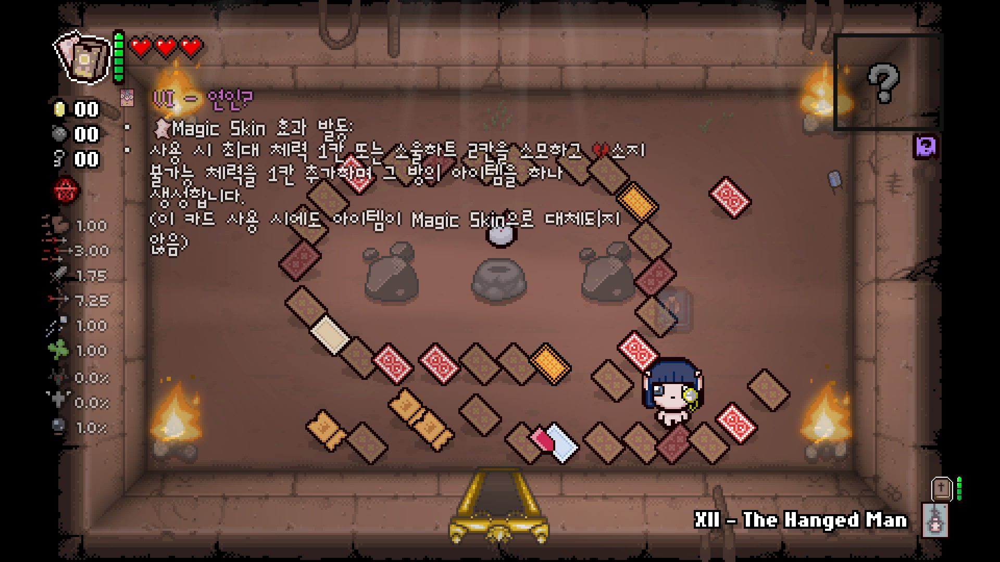

### 특수 시너지 설명

아이템 설명 모드는 평소에는 숨겨져 있다가 캐릭터가 아이템 가까이 갈 경우 해당 아이템의 설명을 표시해 줍니다. 별도의 설정을 하지 않았을 경우 아이템 설명은 아래와 같이 표시됩니다.  
  

- 한국어 설명은 기본적으로** 체력 - 빨간하트 - 블랙하트 - 소울하트 - 공격력 - 연사 - 사거리 - 이동속도 - 탄속 - 행운 - 특수 효과**의 순서대로 표시되며 플레이어의 스탯을 직접 바꾸는 아이템은 별도의 아이콘이 표시됩니다.
- 만약 아이템이 보이지 않는 저주인 눈 먼자의 저주(Curse of Blind)에 걸렸거나, 혹은 리펜턴스 대체 루트의 가려진 선택지인 경우 아이템의 아이콘이 빨간 물음표로 표시되며 해당 아이템의 정보가 가려집니다.

### 스핀다운 다이스

  

- 픽업 아이템은 기본적으로 설명이 표시되며 해당 카드 및 알약의 효과를 바로 알 수 있습니다. 알약은 한 번이라도 확인한 효과의 알약만 표시됩니다.

- 상점에서는 카드의 정보가 표시되지 않습니다.

### 스핀

  

- 주사위 방이나 희생방에서는 밟거나 다음 희생 시 발동되는 효과를 알 수 있습니다.