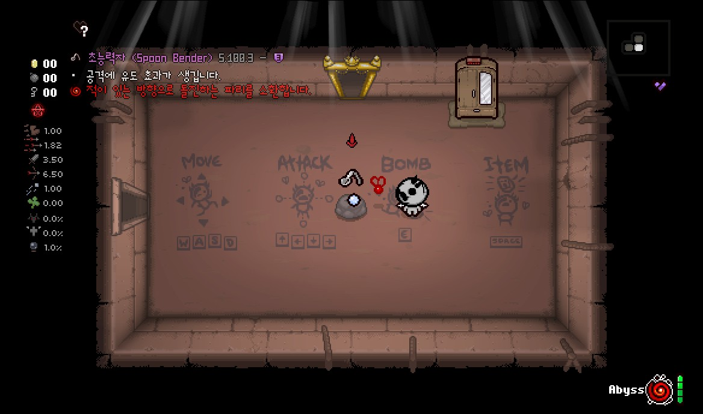
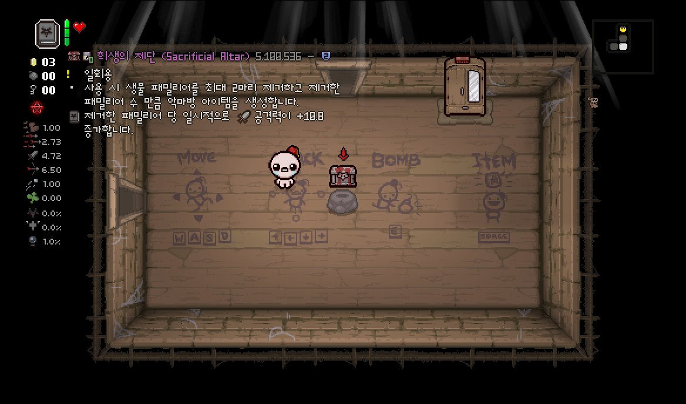
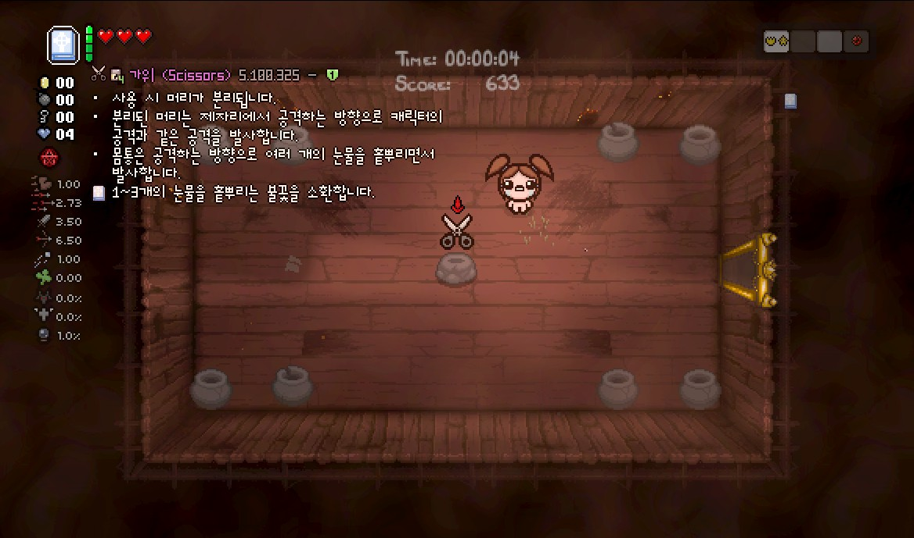
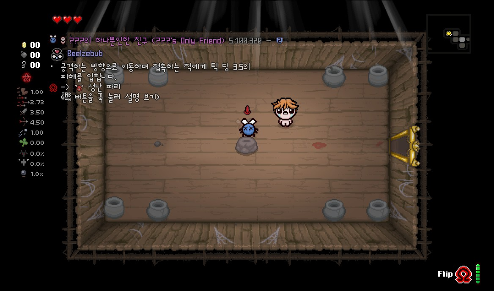
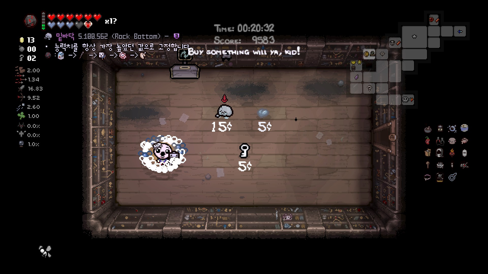
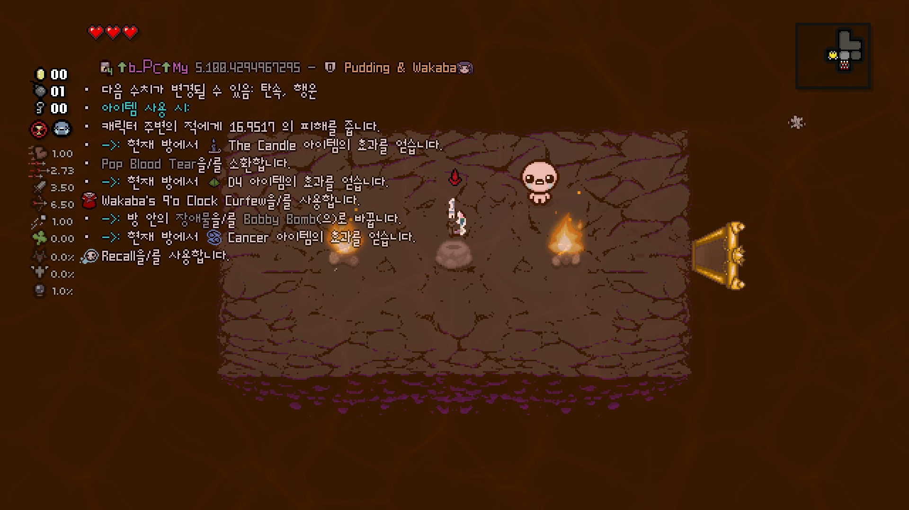

### 특수 시너지 설명

일부 아이템의 시너지는 별도로 표시됩니다. 시너지 아이템을 소지하고 있을 경우 기존 아이템의 설명에 추가 설명이 표시됩니다.  
  
  
  
  
현재 추가 설명이 나오는 아이템은 다음과 같습니다.  

- **Blank Card, Placebo, Clear Rune** : 각 카드/알약/룬의 설명에 쿨타임이 표시됩니다.
- **Book of Virtues** : 소환되는 불꽃의 특징이 표시됩니다.
- **Book of Belial** : 유다의 생득권 효과에 추가되는 설명이 표시됩니다.
- **Abyss** : 각 파리의 설명이 추가됩니다.
- **Binge Eater** : 스탯 증감량 설명이 추가됩니다.
- **Spindown Dice** : 다음 아이템을 아이콘으로 보여줍니다.
- **Flip** : 뒷면의 아이템의 설명을 보여줍니다. Tab 키를 꾹 눌러 볼 수 있습니다.

### 스핀다운 다이스

  
스핀다운 사용 시 예상되는 다음 아이템을 미리 볼 수 있습니다. 설명모드가 해금되지 않았다고 판단하는 아이템은 아이콘 옆에 물음표가 표시됩니다.

### TMTRAINER

  

오류 아이템의 예상되는 스탯 증가량을 표시합니다. ```--luadebug``` 옵션을 사용하면 오류 아이템의 예상 효과를 대략적으로 알 수 있습니다. 
!!! warning "추가 옵션 필요" 
    오류 아이템의 대략적인 효과는 아이작 로그 파일에 기록됩니다. 일반적인 방법으로는 모드가 로그 파일에 접근할 수 없으며 추가 실행 옵션에 ```--luadebug```를 추가해준 후 아이작을 실행시켜야 합니다. ```--luadebug``` 옵션은 일부 악성 모드가 다른 모드의 파일이나 컴퓨터 내 파일을 건들 수 있으므로 가급적이면 사용하지 않는 것을 권장합니다.
!!! warning "주의" 
    오류 아이템의 효과는 예상 설명이며 추가로 설명에 없는 또 다른 효과가 발생할 수 있습니다.