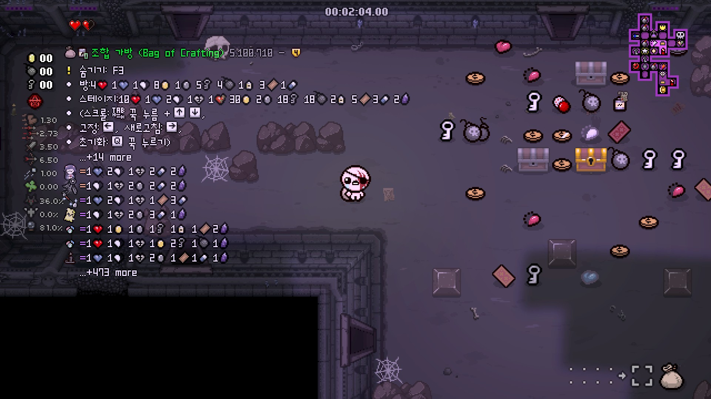
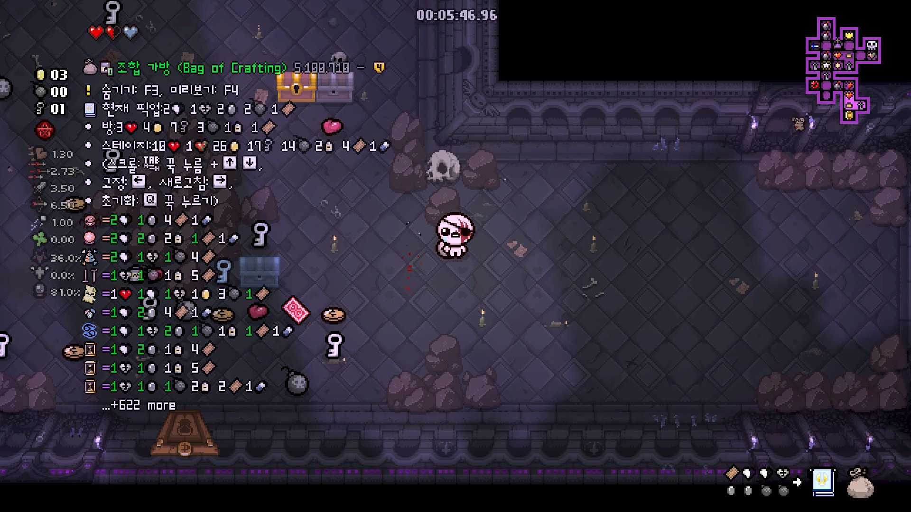
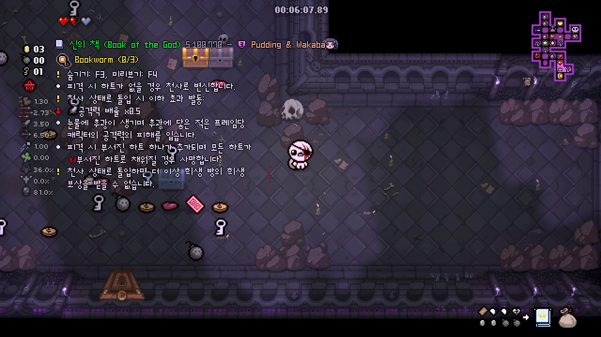

## Bag of Crafting

아이작의 번제 : 리펜턴스의 캐릭터 중에서 아이템을 얻지 못하고 직접 DIY 마냥 조합해야 되는 캐릭터가 있습니다. 해당 캐릭터는 '조합의 가방'이라는 전용 아이템을 이용해 픽업 아이템을 8개를 조합하여 아이템을 생성해야만 합니다.  

조합의 가방 레시피는 완전한 랜덤이 아니며 현재 게임의 시드, 그리고 가방에 담긴 픽업으로 결정되며 따라서 한 게임 당 거의 1000만에 달하는 레시피가 새로 나오기 때문에 이걸 외우는 것은 불가능합니다.  

다행스럽게도 일부 아이작 팬들이 아이템이 나오는 방식을 발굴하였고, 해당 방식을 기반으로 아이템 설명 모드에도 레시피를 넣는 것이 가능해졌습니다.

## 레시피 목록 활성화 방법

레시피는 기본적으로 활성화 되어 있으며 업데이트 이전 사용자의 경우 추가 옵션을 통하여 활성화할 수 있습니다. 활성화 방법은 다음과 같습니다.

- 게임 시작 직후 ++l++ 키, 혹은 ++f10++ 키를 눌러 Mod Config Menu 진입
- EID -> Crafting -> Display Mode를 'Recipe List'으로 설정

## 레시피 목록은 언제 나올까?

레시피 목록은 현재 층에서 아이템 제작이 가능할 때 등장하기 시작하며 현재 층에 있는 픽업을 모아 레시피를 지정된 수만큼 레시피 제작을 시도합니다. 레시피는 기본적으로 방 안에 적이 있으면 표시되지 않습니다. ++f3++키를 눌러 레시피 목록을 잠시 숨길 수 있으며 현재 가방 안에 픽업이 8개 모여 있다면 ++f4++키를 눌러 완성될 아이템의 설명을 볼 수 있습니다.

## 레시피 목록

 

설명모드는 기본적으로 레시피 목록 뿐만 아니라 현재 방, 스테이지, 혹은 현재 가방 안의 픽업 정보를 보여주며 그 밑에 대략적인 레시피가 표시됩니다. 
레시피 왼쪽에는 완성된 아이템이, 오른쪽은 필요한 픽업이 표시되며 등호의 색상은 각 아이템의 퀄리티를 의미합니다.  
**(회색 : 0, 연두색 : 1, 파란색 : 2, 보라색 : 3, 노란색 : 4)**  
한 페이지 당 7~11개의 레시피가 표시되며 ++tab++키를 누른 상태에서 여러 버튼을 조작하여 목록을 업데이트할 수 있습니다.

아이템 설명모드의 레시피는 게임이 느려지는 것을 방지하기 위해서 한 번에 특정 횟수의 레시피만을 계산합니다. 기본적으로 최상위 12종류의 픽업과 400개의 랜덤 레시피를 계산합니다. ++tab+right++ 키로 레시피를 추가로 계산할 수 있습니다. 레시피 계산 횟수는 Mod Config Menu에서 설정할 수 있습니다.

 
 
8개의 아이템이 조합될 경우 예상 아이템을 미리 보여주며 ++f4++키로 해당 아이템의 설명을 볼 수 있습니다.

| 조작 | 설명 |
| ------------ | ------------- |
| ++tab+up++ | 이전 페이지 |
| ++tab+down++ | 다음 페이지 |
| ++tab+left++ | 목록 고정 : 픽업 정보가 변경되어도 목록이 갱신되지 않습니다. |
| ++tab+right++ | 목록 새로고침 : 설명모드는 최적화를 위해 모든 레시피를 한번에 계산하지 않습니다. 새로고침을 수행하면 레시피를 추가로 계산하여 보여줍니다. |
| ++tab+q++ | 꾹 눌러 가방 내용물 초기화 : 설명모드의 가방 내용물 표시와 실제 가방과 싱크가 맞지 않을 경우 사용합니다. 이 경우 설명모드의 가방 내용물이 삭제되기 때문에 픽업을 다시 주운 후 재계산이 필요합니다. |

