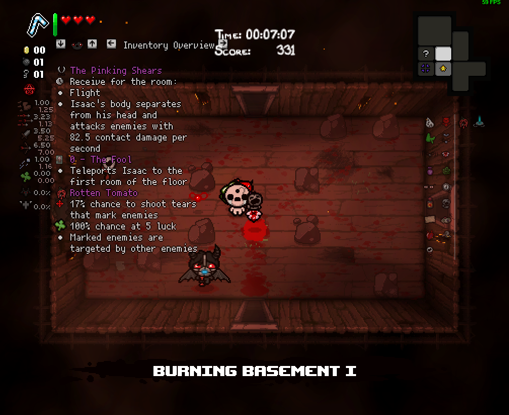
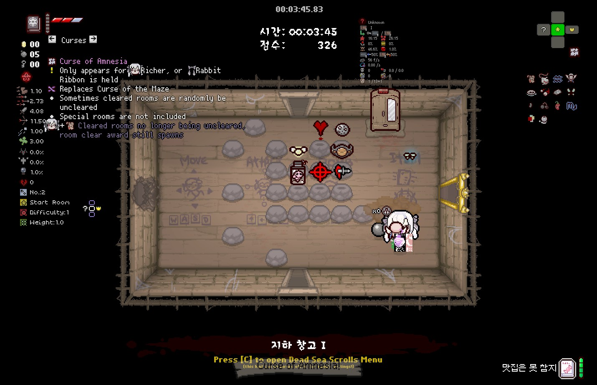

### 리마인더

리마인더는 Tab 키를 꾹 누른 상태에 등장하는 특수 설명으로 현재 획득한 아이템, 장신구 등의 설명을 다시 표시해주는 기능입니다.
기본적으로 아래 카테고리를 지원하며 다른 모드에 의해 표시되는 카테고리가 추가될 수 있습니다.

- 요약
- 스페셜
- 액티브
- 카드/알약 슬롯
- 장신구
- 패시브

(저주 설명은 다른 모드에 의해 추가되었으며 기본적으로 포함되지 않습니다.)

리마인더 설정은 아래와 같습니다.

- 게임 시작 직후 ++l++ 키, 혹은 ++f10++ 키를 눌러 Mod Config Menu 진입
- EID -> Reminder -> Item Reminder Description를 'Enabled'으로 설정
- EID -> Reminder -> Hold to Show에서 원하는 단축히 설정

### 아이템 예상 결과

일부 아이템은 리마인더에서 예상 효과를 보여줍니다.

### 숨겨진 효과, 랜덤 효과 예측

숨겨진 효과 및 랜덤 효과 예측 기능은 기본적으로 활성화 되어 있지 않으며 추가 옵션을 통하여 활성화할 수 있습니다. 활성화 방법은 다음과 같습니다.

- 게임 시작 직후 ++l++ 키, 혹은 ++f10++ 키를 눌러 Mod Config Menu 진입
- EID -> Reminder -> Show Hidden Informations를 'True'으로 설정
- EID -> Reminder -> Show RNG Predictions를 'True'으로 설정

