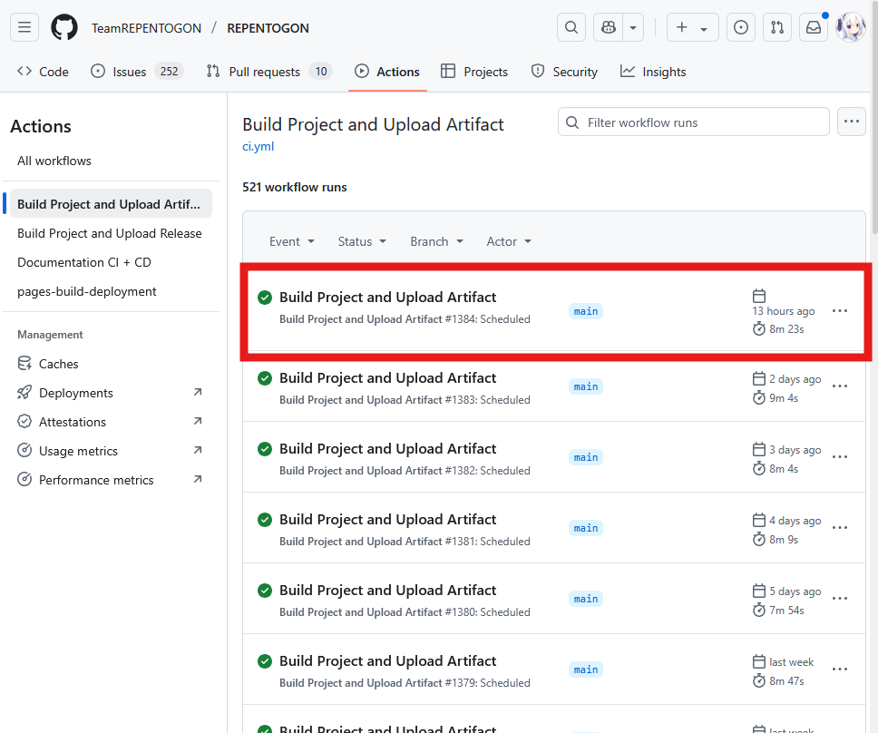
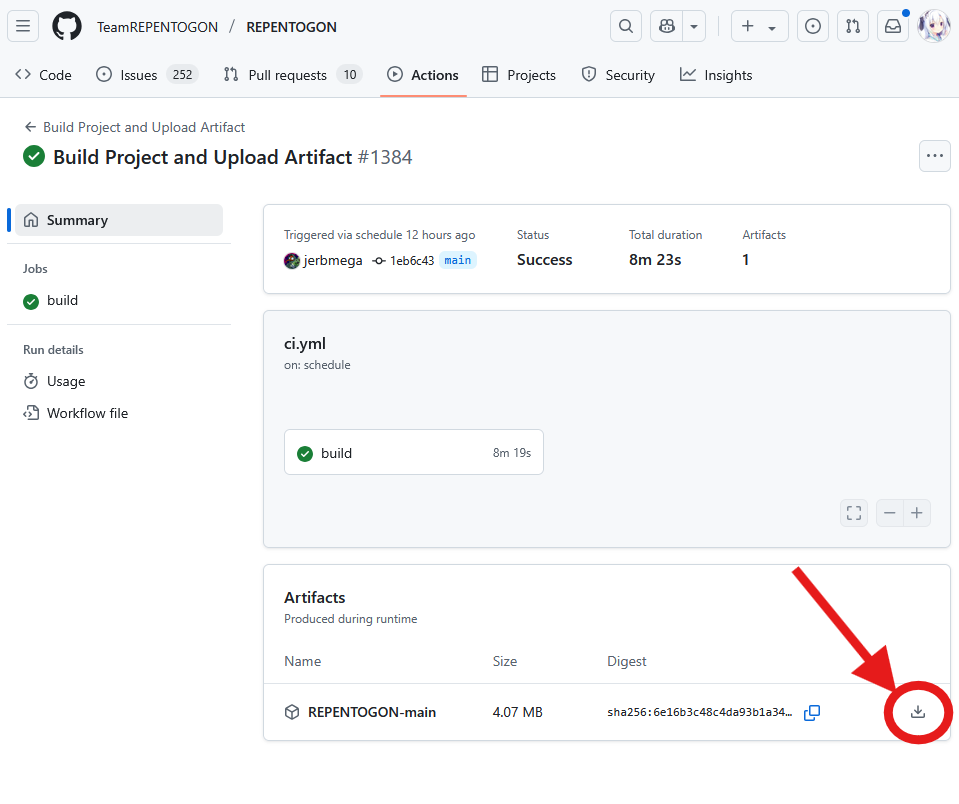
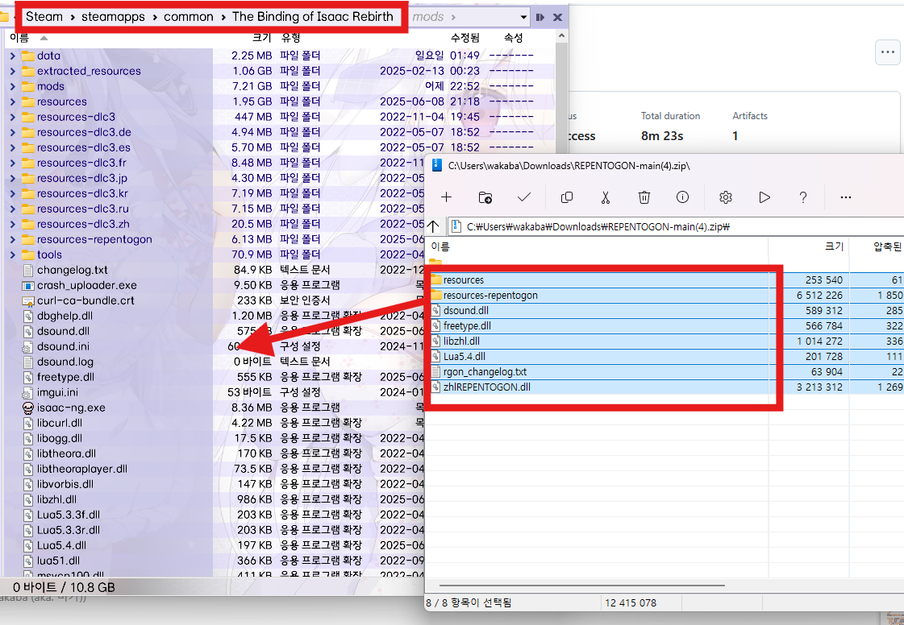
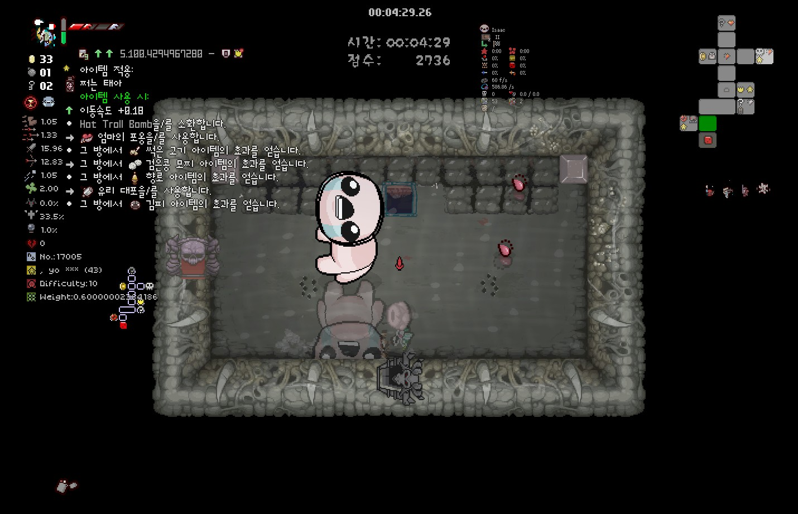
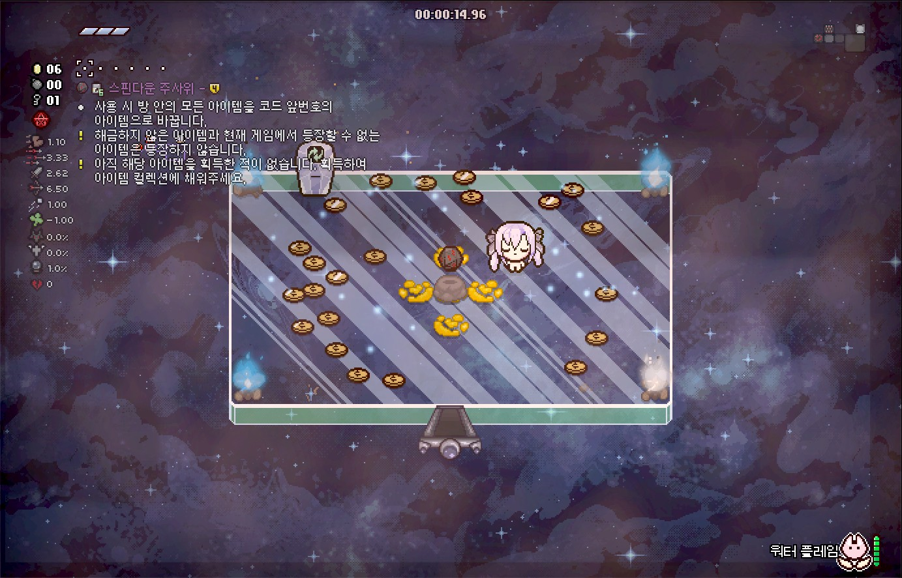
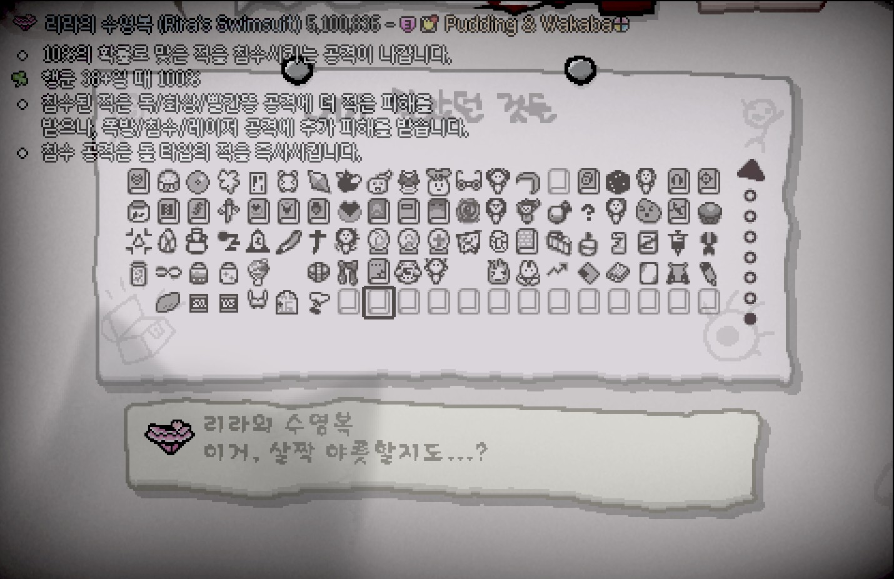
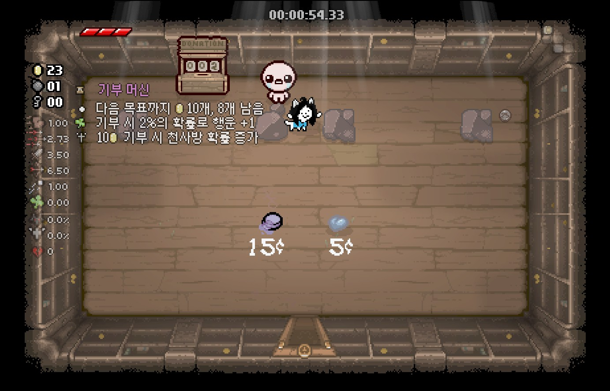

### 개요

REPENTOGON은 다수의 아이작 모드 개발자들에 의해 리버스 엔지니어링을 통해 만들어진 후킹형 모드입니다.
아이작에서 제공하는 빈약한 API를 보완하기 위해 만들어진 커뮤니티 모드이며 기존에는 지원하지 않던 기능을 추가로 지원하게 만들어 줍니다.
아이템 설명모드 역시 일부 기능은 REPENTOGON의 적용이 필요합니다.

### REPENTOGON 설치 방법

REPENTOGON의 설치는 다른 모드와는 다르게 창작마당에서의 설치가 불가능합니다. 따라서 최초 설치 시 수동으로 설치가 필요합니다.
[REPENTOGON 설치 페이지(영문)](https://repentogon.com/install.html) 항목 참조

- [REPENTOGONUpdater.exe](https://github.com/TeamREPENTOGON/Installer/releases/latest/download/REPENTOGONUpdater.exe) 다운로드
- 스팀 라이브러리에서 ```The Binding of Isaac: Rebirth``` 오른쪽 클릭 > 관리 > 로컬 파일 탐색 클릭
- 다운로드한 업데이트 프로그램을 열린 폴더에다가 압축 해제 (```isaac-ng.exe```와 ```REPENTOGONUpdater.exe```가 같은 폴더에 있어야 함)
- ```REPENTOGONUpdater.exe``` 실행 후 ```Install``` 버튼 클릭

### 리펜턴스+에서의 REPENTOGON 설치 방법

리펜턴스+ DLC는 현재 REPENTOGON이 공식적으로 지원되지 않으나 개발 중 버전을 받을 수 있습니다. 개발 중 버전 특성 상 자동 업데이트가 지원되지 않습니다.

- [REPENTOGON Github Actions](https://github.com/TeamREPENTOGON/REPENTOGON/actions/workflows/ci.yml) 접속
- 목록에서의 'Build Project and Upload Artifact' 중 맨 위의 항목 클릭 (되도록 옆에 초록색 V 표시가 있는 것을 클릭해 주세요)



- 하단의 Artifacts 우측의 다운로드 버튼 클릭



- 다운로드 받은 압축 파일 내용을 아이작 설치 폴더에 풀기



### TMTRAINER



글리치 아이템의 예상되는 스탯 증가량을 표시합니다. REPENTOGON 적용 시 글리치 아이템의 예상 효과를 대략적으로 알 수 있습니다.
글리치 아이템은 기본적으로 반드시 1개의 아이템/장신구를 할당합니다. 액티브가 할당되어 있는 경우 소지 중 효과만 발동됩니다.
글리치 아이템은 추가적으로 1가지 이상의 조건을 가지며 각 조건의 종류는 크게 8개로 나뉩니다.

| 조건 | 설명 |
| ------------ | ------------- |
| **아이템 사용시** | 글리치 아이템이 액티브 아이템일 때만 할당되며 액티브 아이템 사용 시 효과를 발동합니다. |
| **픽업을 주울 시** | 동전, 폭탄, 열쇠, 아이템, 장신구, 카드, 알약 등을 주우면 효과를 발동합니다. |
| **적을 죽일 시** | 적이 죽으면 ***일정 확률***로 효과를 발동합니다. |
| **캐릭터 피격 시** | 캐릭터가 대미지를 입으면 효과를 발동합니다. |
| **특정 엔티티가 소환될 시** | 지정된 엔티티가 소환되면 효과를 발동합니다. 엔티티가 지정되는 범위는 없기 때문에 순수 이펙트라도 발동될 수 있습니다. |
| **눈물 발사 시** | 캐릭터나 패밀리어가 눈물을 발사하면 ***일정 확률***로 효과를 발동합니다. |
| **적이나 보스 명중 시** | 적 혹은 보스가 대미지를 입으면 ***일정 확률***로 효과를 발동합니다. |
| **방 클리어 시** | 방 클리어 판정이 나면 효과를 발동합니다. |

위의 조건을 기반으로 대략 1~6가지의 효과가 일어나며 일어날 수 있는 효과의 종류는 크게 6가지로 나뉩니다.

| 발동 효과 | 설명 |
| ------------ | ------------- |
| **에어리어 대미지** | 캐릭터 주변의 반경 ?칸 안의 적에게 n의 피해를 입힙니다. 이 피해는 지정된 대미지 플래그가 있기 때문에 일부 아이템은 방어 무시 대미지를 입힐 수 있습니다. |
| **아이템 효과 획득** | 현재 방에서 특정 아이템의 효과를 얻습니다. 이 아이템의 효과는 소위 '아이템 이펙트'라는 것으로 아이템 이펙트만으로도 효과가 발동되는 아이템만 실제로 효과가 발동되며 실제 아이템 보유 시에만 효과를 발동하는 경우(예시: 액티브 아이템, Technology 등) 효과가 발동되지 않습니다. |
| **엔티티 변환** | 방 안의 A 엔티티를 B 엔티티로 바꿉니다. 제한 범위가 없기 때문에 아이템이 없어지거나 상자가 뜬금없이 생기는 경우가 생길 수 있습니다. |
| **아이템 사용** | 특정 아이템을 액티브 아이템으로서 사용합니다. |
| **엔티티 소환** | 특정 엔티티를 소환합니다. |
| **방귀** | 반경 n칸만큼의 랜덤 방귀를 뀝니다. |

??? note "아이템 효과 획득으로 발동될 수 있는 아이템 목록 / 출처 제공 : Hybrid"
    - Sad Onion
    - Inner Eye
    - Spoon Bender
    - My Reflection
    - Number One
    - Brother Bobby
    - Magic Mushroom
    - The Virus
    - Roid Rage
    - Transcendence
    - Mom's Underwear
    - Mom's Heels
    - Mom's Lipstick
    - Mom's Eye
    - Distant Admiration
    - Sister Maggy
    - Growth Hormones
    - Mini Mush
    - Cube of Meat (모든 단계)
    - Little Chubby
    - Sack of Pennies
    - Robo-Baby
    - Little Chad
    - The Relic
    - Little Gish
    - Little Steven
    - The Wafer
    - Mom's Contacts
    - Guardian Angel
    - Demon Baby
    - Mom's Knife
    - Ouija Board
    - Dead Bird (피격 유무와 상관없이 새가 즉시 소환됨)
    - Brimstone
    - Odd Mushroom (Thin)
    - Odd Mushroom (Large)
    - Whore of Babylon (빨간하트 개수와 무관하게 즉시 발동)
    - Forever Alone
    - Bomb Bag
    - Speed Ball
    - Bum Friend
    - Tough Love
    - Peeper (스탯 미적용)
    - Ghost Baby
    - Harlequin Baby
    - Daddy Longlegs
    - Sacrificial Dagger
    - Rainbow Baby
    - Holy Water
    - Guppy's Hairball
    - Abel
    - Mom's Key
    - Mom's Eyeshadow
    - Iron Bar
    - The Guillotine
    - Ball of Bandages (모든 단계)
    - Anemic (피격 유무와 상관없이 장판 생성)
    - Mom's Wig
    - Mom's Perfume
    - Death's Touch
    - Experimental Treatment (스탯 변화량은 각 방마다 정해짐)
    - 20/20 (공격력 감소 없음)
    - Hive Mind
    - Fire Mind
    - Dark Matter
    - Proptosis
    - Smart Fly
    - Dry Baby
    - Juciy Sack
    - Robo-Baby 2.0
    - Rotten Baby
    - Headless Baby
    - Leech
    - Mystery Sack
    - BBF
    - Bob's Brain
    - Best Bud (피격 유무와 상관없이 파리가 즉시 소환됨)
    - Lil Brimstone
    - Lil Haunt
    - Dark Bum
    - Big Fan
    - Sissy Longlegs
    - Punching Bag
    - Leo
    - Holy Mantle
    - Mysterious Liquid
    - Gemini
    - Cain's Other Eye
    - ???'s Only Friend
    - Samson's Chains
    - Mongo Baby
    - Blue Cap
    - Synthoil
    - Mom's Pearls
    - The Wiz
    - Incubus
    - Fate's Reward
    - Lil Chest
    - Sworn Protector
    - Friend Zone
    - Lost Fly
    - Charged Baby
    - Holy Light
    - Lil Gurdy
    - Bumbo
    - Censer
    - Key Bum
    - Rune Bag
    - Seraphim
    - Tractor Beam (연사 증가만 적용)
    - God's Flesh
    - Spider Mod
    - Farting Baby
    - Empty Vessel (빨간하트 개수와 상관없이 비행 항상 적용, 보호막은 발동되지 않음)
    - Lusty Blood (효과 획득 시마다 스택 증가, 처치 시에는 스택이 증가하지 않음)
    - Crown of Light (사거리, 탄속만 적용)
    - Succubus
    - Fruit Cake
    - Obsessed Fan
    - Head of the Keeper
    - Papa Fly
    - Multidimensional Baby
    - Lil Loki
    - Milk! (연사 증가만 적용됨)
    - Dark Prince's Crown (빨간하트 개수와 상관없이 적용)
    - Finger!
    - Shade
    - Depression
    - Hushy
    - Lil Monstro
    - King Baby
    - Big Chubby
    - Acid Baby
    - Yo Listen!
    - Adrenaline
    - Euthanasia
    - Camo Undies
    - Sack of Sacks
    - Mom's Razor
    - Bloodshot Eye
    - Angry Fly
    - Buddy in a Box
    - Lil Delirium
    - 7 Seals
    - Angelic Prism
    - Lil Spewer
    - Mystery Egg
    - Slipped Rib
    - Hallowed Ground
    - Pointy Rib
    - Jaw Bone
    - Blood Puppy
    - Paschal Candle (아이템 효과 획득마다 연사 증가, 패밀리어는 없음)
    - Eye of the Occult (눈물효과만 적용)
    - Intruder (피격 시 거미를 뱉지 않음)
    - Psy Fly
    - Mars (대시 즉시 사용)
    - Uranus
    - Boiled Baby
    - Freezer Baby
    - Bird Cage (피격 유무와 상관없이 새가 즉시 소환됨)
    - Lil Dumpy
    - Bot Fly
    - Tinytoma
    - Fruity Plum
    - Cube Baby
    - Astral Projection (피격 시 효과가 즉시 발동됨)
    - Lil Abaddon
    - Lil Portal
    - Worm Friend
    - Inner Child (추가 목숨을 주지 않으나 부활 직후의 효과가 즉시 적용됨)
    - Twisted Pair
    - Mom's Ring

일부 효과는 연속적으로 일어날 수 있으며 그 이전의 행동에 **성공**해야만 그 다음의 효과가 발동됩니다.

### 컬렉션 페이지





REPENTOGON 적용 시 획득하지 않은 아이템의 경우 설명 하단에서 확인할 수 있습니다.
메인 메뉴의 통계 > 아이템 항목에서도 획득한 아이템의 설명을 확인할 수 있습니다.

### 기부 기계



REPENTOGON 적용 시 기부기계 해금 현황을 확인할 수 있습니다.