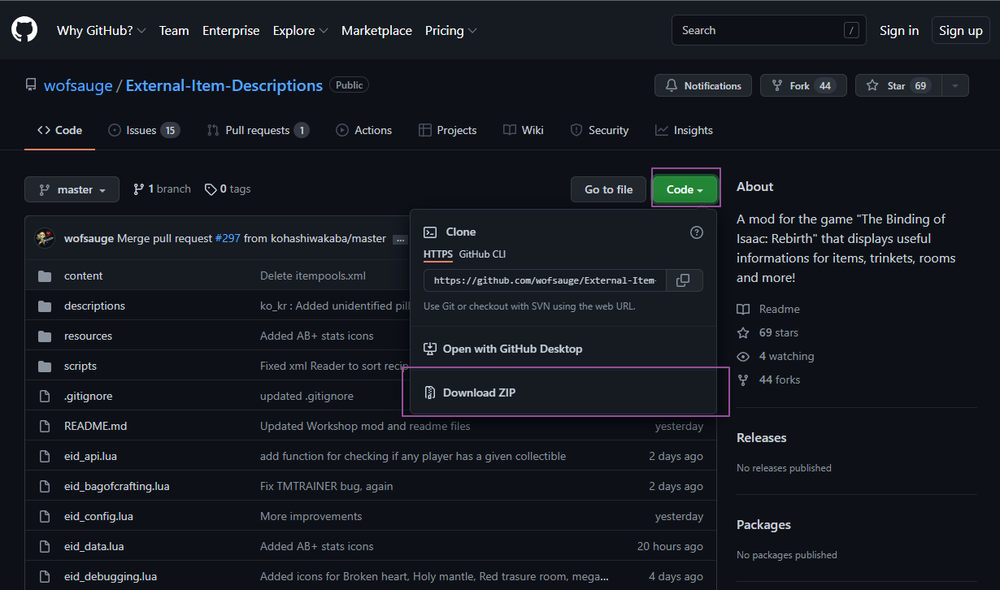
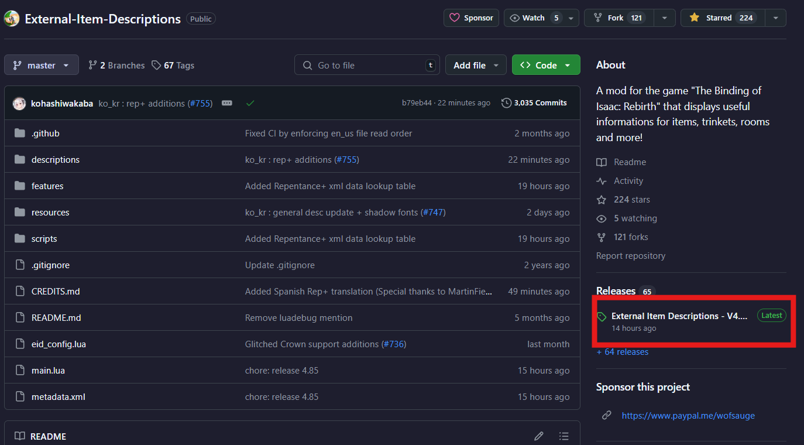
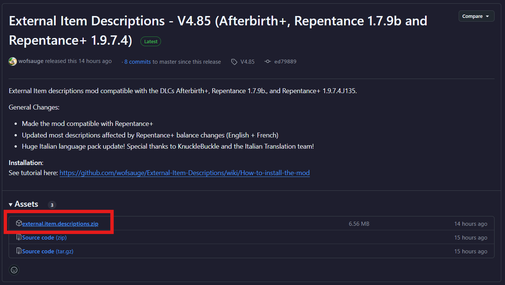
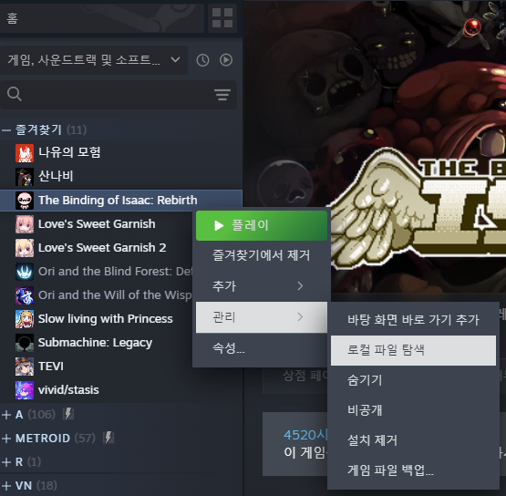
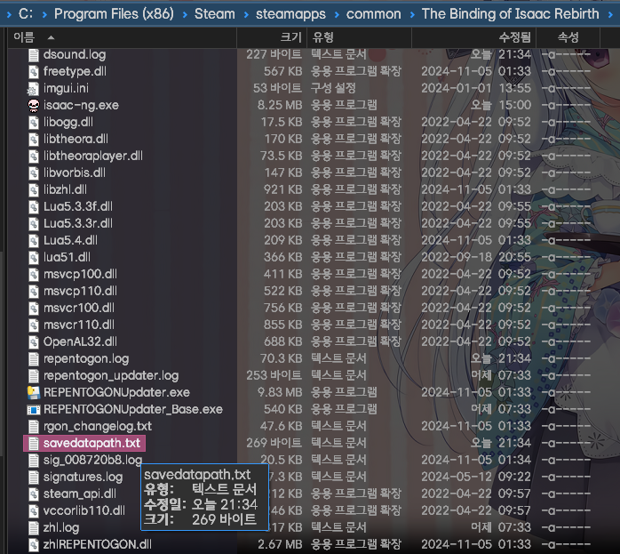
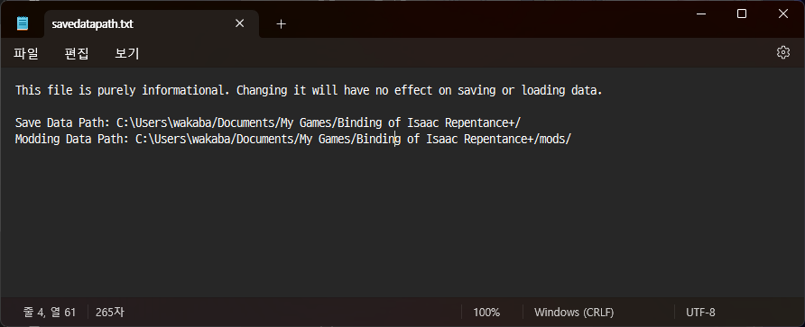
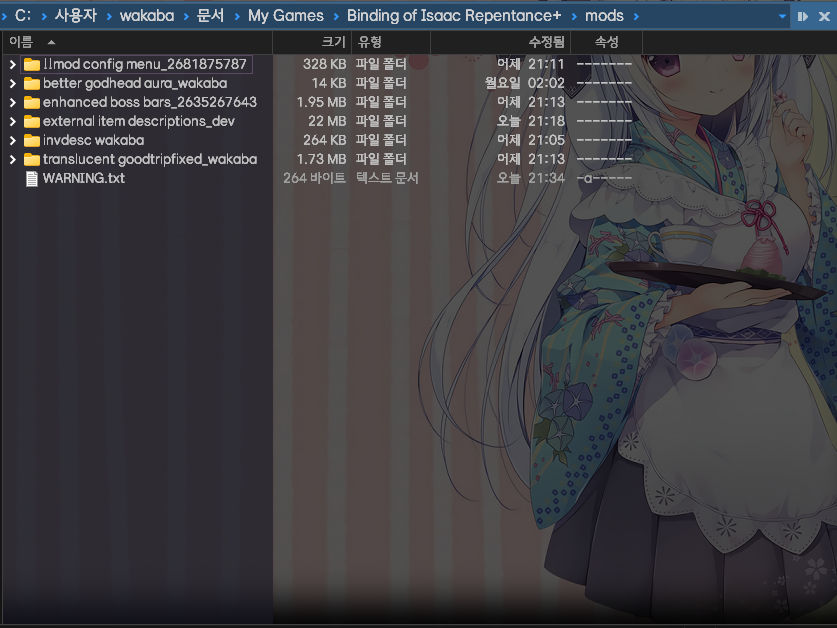
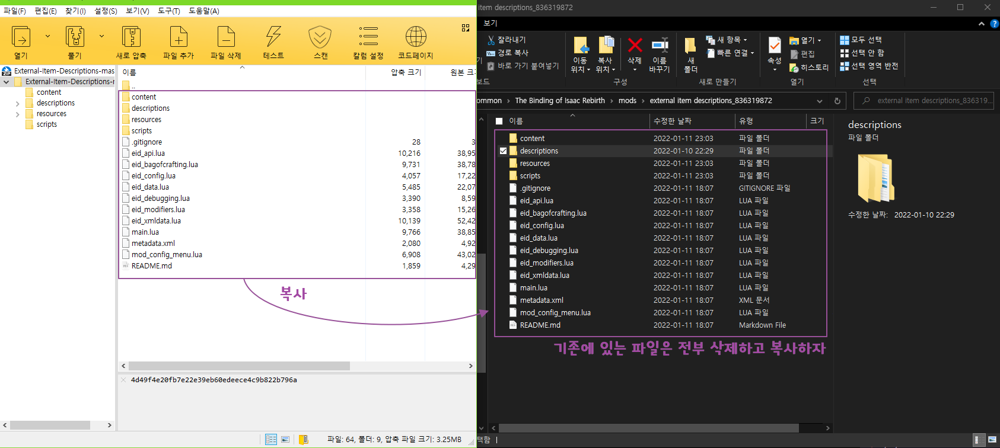
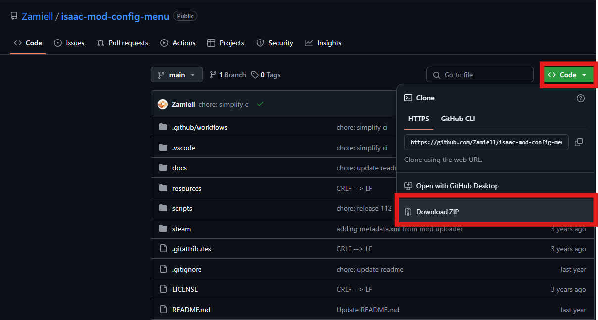
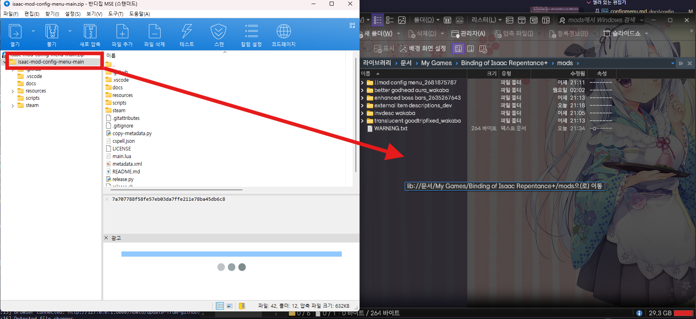

### 업데이트를 더 빨리 받고 싶어요

아이템 설명 모드는 Wofsauge를 비롯한 여러 개발자가 개발하는 모드입니다. 따라서 개발자 및 번역가들이 Github 프로젝트에 먼저 올린 후 일정 간격 이후 스팀 창작마당에 업로드 됩니다. 스팀 버전보다도 빠른 업데이트를 받고자 한다면 [Github 프로젝트](https://github.com/wofsauge/External-Item-Descriptions)에서 직접 받으시는 걸 권장드립니다.

### Github에서 직접 받기 (개발 버전)

1. [https://github.com/wofsauge/External-Item-Descriptions](https://github.com/wofsauge/External-Item-Descriptions) 페이지 접속
2. 오른쪽의 Code 버튼을 누르고 나온 네모 상자에서 Download Zip을 클릭합니다.  

### Github에서 직접 받기 (릴리즈 버전, 리펜턴스+ DLC 이용자는 여기로)

1. [https://github.com/wofsauge/External-Item-Descriptions](https://github.com/wofsauge/External-Item-Descriptions) 페이지 접속
2. 오른쪽의 Releases 항목 밑의 최신 버전 링크 클릭

3. 릴리즈 페이지에서 external.item.descriptions.zip 링크를 클릭하여 다운로드

### 아이작 모드 폴더 찾기
1. 스팀 라이브러리에서 The Binding of Isaac: Rebirth 항목을 오른쪽 클릭
2. 메뉴에서 관리 > 로컬 파일 탐색 클릭 

3. 새로 열린 창에서 savedatapath.txt 열기 

4. savedatapath.txt 파일 중 Modding Data Path 옆에 있는 주소를 복사 후 탐색기 주소창에 붙여넣기 

!!! warning
    위 주소에 한글이 있으면 모드 적용이 불가능합니다. 윈도우를 재설치하여 계정 이름을 영어로 설정한 후 진행해 주세요.
5. 다운로드 받은 zip 파일을 위의 주소로 이동한 폴더에 압축 풀기 
 

- 충돌 방지를 위해 기존 모드 폴더에 있는 파일은 전부 삭제하고 복사해 주세요.

### Mod Config Menu 받기

1. [https://github.com/Zamiell/isaac-mod-config-menu](https://github.com/Zamiell/isaac-mod-config-menu) 페이지 접속
2. 오른쪽의 Code 버튼을 누르고 나온 네모 상자에서 Download Zip을 클릭합니다.
3. 다운로드 받은 zip 파일을 아이작 모드 폴더 찾기-4에서 확인한 주소로 이동한 폴더에 압축 풀기 
 
