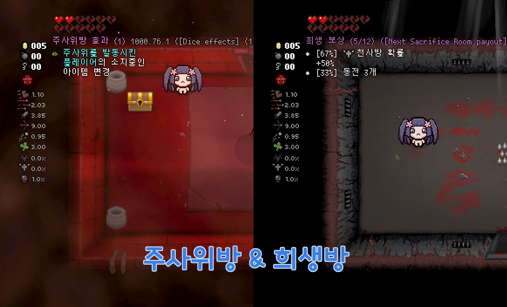
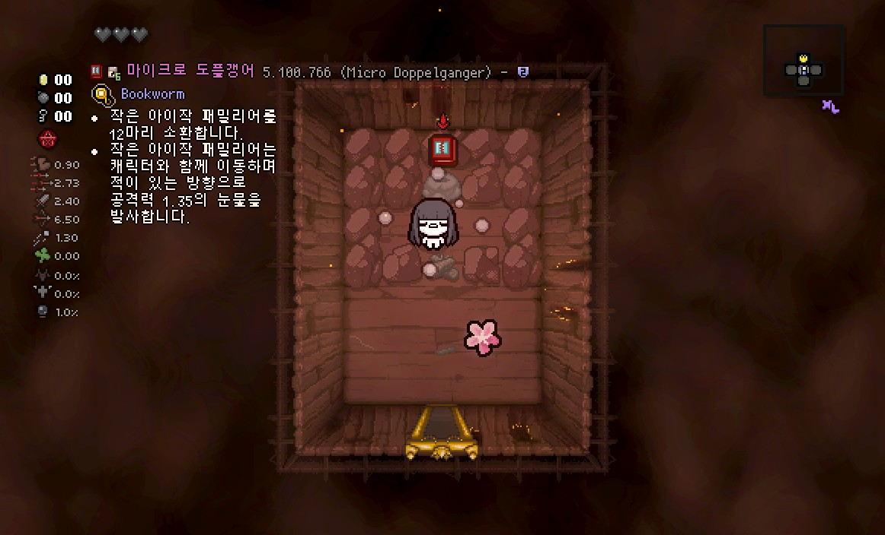
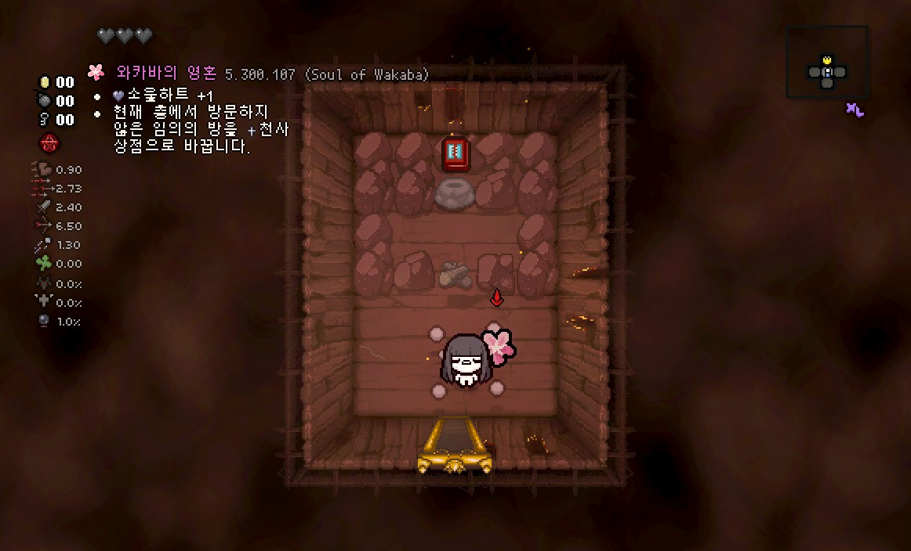
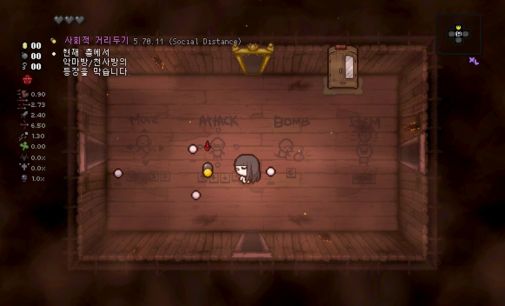
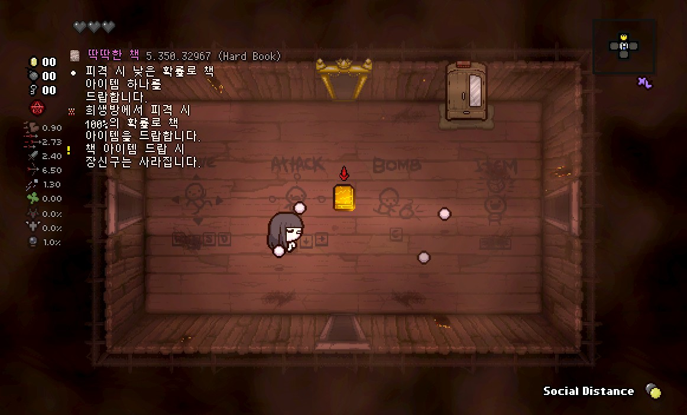
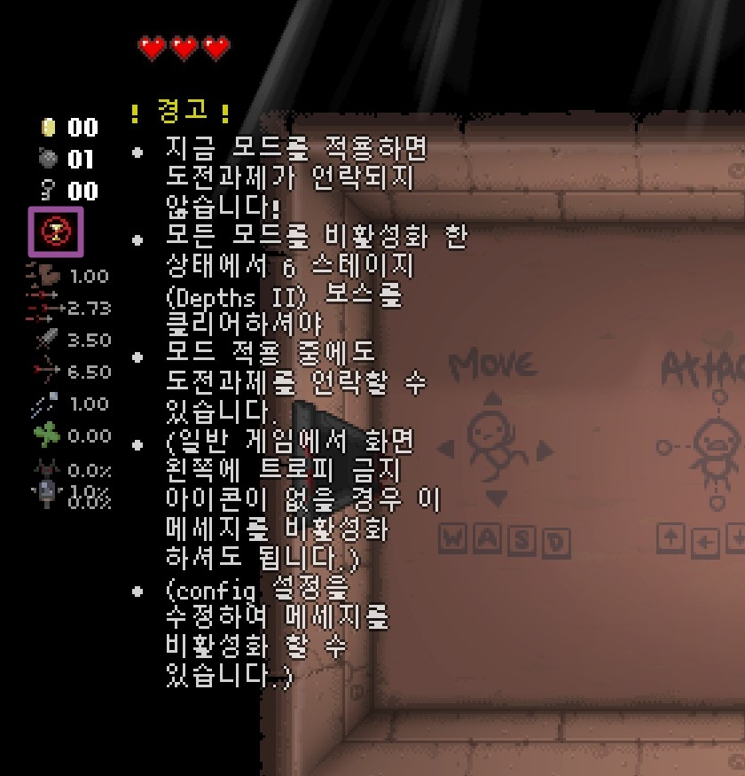
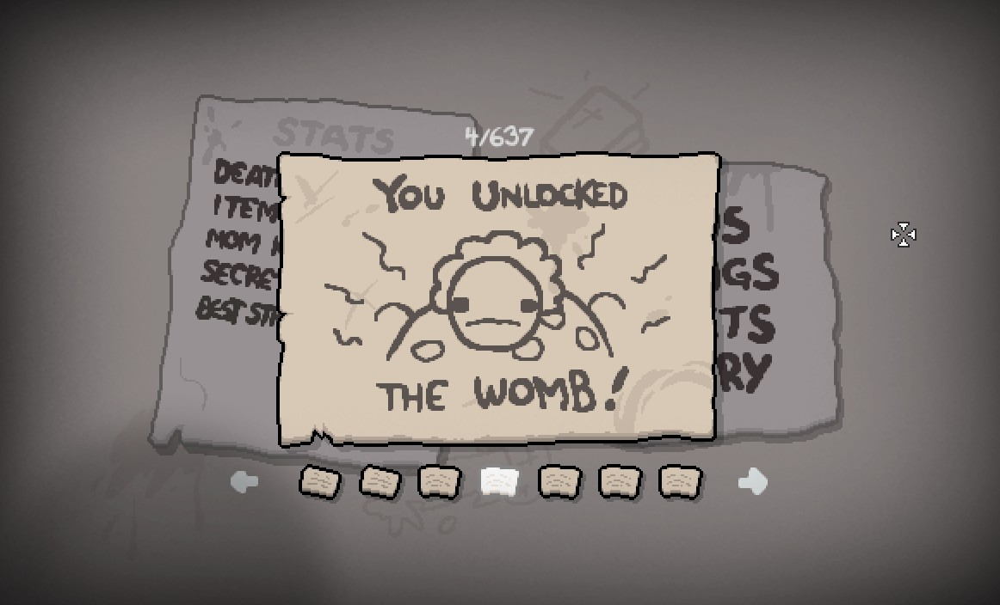
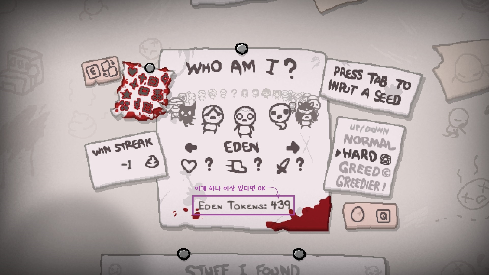
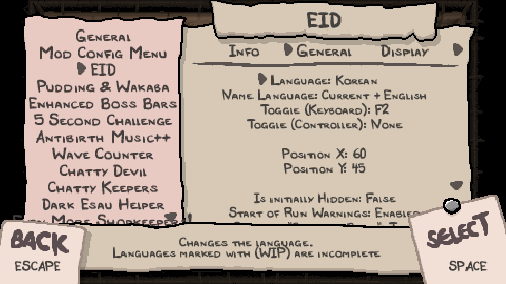

!!! warning "해당 가이드는 제작중입니다."
    일부 페이지는 '준비중'으로 표기되므로 양해 부탁드립니다.
    [자주묻는 질문은 여기로](./faq)

!!! info "마지막 업데이트 : 2022-06-17"
    - Item Reminder(리마인더) 기능 추가 : Tab 키를 꾹 누른 상태에서 현재 소지 중인 액티브/카드/알약/장신구 및 현재 방에서 획득한 아이템의 정보를 보여줍니다.
    - Sanguine Bond 아이템의 예측 기능 추가(기본값으로 표시되지 않게 설정됨)
    - 모드 지원을 위한 신규 아이콘 추가

## For Non-Korean users
!!! note ""
    This (unfinished)documentation contains instruction or information for Korean users.  
    To check original External items Descriptions information, try to visit following links below:

- [Steam Workshop Link](https://steamcommunity.com/sharedfiles/filedetails/?id=836319872)
- [Github Project link](https://github.com/wofsauge/External-Item-Descriptions)
- [EID Wiki](https://github.com/wofsauge/External-Item-Descriptions/wiki)
- [Wofsauge's Modding Central Discord](https://discord.com/invite/HhD4vMM4bZ)
---
## 아이템 설명 모드가 무엇인가요?
**아이템 설명 모드(External Item Descriptions)**는 아이작의 번제 애프터버스+, 및 리펜턴스의 아이템과 희생방, 주사위방의 효과를 화면에 출력하는 모드입니다. 아이작의 번제 게임은 수백가지의 아이템, 장신구, 알약, 카드 등의 아이템이 있으며 이러한 아이템들의 효과는 제각각 다른 기능을 가집니다. 어느 효과는 좋은 효과를 갖고 있지만, 어느 효과는 나쁜 효과를 가지는 등 운에 기대야 되는 상황이 발생하기 마련, 브라우저를 키고 외부 사이트에 접속하여 아이템의 효과를 찾으려 하는 번거로운 작업을 거치곤 합니다. 아이템 설명 모드는 이러한 아이템들의 효과를 게임 안에 표시하게 해줌으로서 귀찮은 작업을 하지 않아도 되어 편하게 게임을 할 수 있게 해줍니다. 현재 아이템 설명 모드는 한국어를 포함한 여러 언어를 지원하고 있습니다.

---

### 어? 한글 설명 모드가 있었지 않았나요?
Blackcreamtea가 번역, 혹은 제작했던 한글 설명 모드는 2022년 1월 한국어가 아이템 설명 모드와 통합되기 전에 많은 유저들이 절찬리에 애용했습니다. 애프터버스 + 까지는 읽기 좋은 소야 폰트를 사용하여 한국인이 더 쉽게 설명을 읽을 수 있게 하는 등 많은 고유 요소를 갖고 있었습니다. 하지만 리펜턴스 출시 이후 이러한 고유 요소가 오히려 독이 되어 한글 설명 모드만 키면 다른 모드가 모조리 먹통이 되는 등 점점 다양한 모드를 즐기는 것이 불가능하게 되면서 결국, 몇몇 유저의 제안 및 Wofsauge의 노력으로 기존 한국어 번역을 아이템 설명 모드에 포함시키게 되었습니다.

---
## 아이템 설명 모드의 기능은?

{: width="600"}
{: width="600"}
{: width="600"}
{: width="600"}
{: width="600"}


- **게임 내에서 F2 키로 설명 켜기/끄기 가능**
- 액티브/패시브/패밀리어 아이템, 장신구, 카드/알약, 희생방, 주사위방의 타입과 효과 출력 및 출력 여부 설정 가능
- Tab 키를 눌러 현재 소지 중인 액티브, 장신구, 카드/알약 출력 및 출력 여부 설정 가능
- (리펜턴스) 아이템의 퀄리티(등급) 출력
- 아이템의 액티브 충전량, 변신세트 출력
- 텍스트의 크기, 위치, 투명도, 색상, 인식 범위 설정 가능
- 아이템 이름 영어 / 현재 언어 / 현재 언어 + 영어 중 선택 가능
- 상점의 카드, 알약 설명 출력 여부, 블라인드 저주 및 가려진 선택지일 때 아이템 설명 출력 여부 등 설정 가능
- 전투 중 설명 숨기기 설정 가능
- 마우스 커서를 액티브 아이템과 픽업 그림에 올려 설명 확인 (베타)
- 모드 아이템 설명 추가 가능([영어](https://github.com/wofsauge/External-Item-Descriptions/wiki)/[영어(모든 기능)](https://github.com/wofsauge/External-Item-Descriptions/blob/master/eid_api.lua)/한국어(준비중))
- (리펜턴스) [알트 카인의 레시피 실시간 확인 (베타)](./howto/crafting)
- (리펜턴스) [스핀다운 주사위 예상 결과 확인](./howto/advanced)

## ⭐⭐⭐사용 전 필독⭐⭐⭐
!!! warning "모드 설치 전 필수 확인 사항"
    {: width="50%"}
    
    - **만약 게임을 설치하자마자 모드나 콘솔을 적용하고 게임을 시작하면 왼쪽 위의 '트로피 금지' 표시가 나오게 됩니다.** 이 표시는 캐릭터 및 도전과제 해금이 불가능하다는 표시이기 때문에 이 상태로 게임을 시작하게 되면 게임을 1%도 즐기지도 못하는 상황이 일어나게 됩니다. 따라서 우선적으로 모드 금지 제한을 해제하는 것이 좋습니다.
    - 위의 메시지는 Cube of Meat 아이템 해금 여부에 따라 표시됩니다. 도전과제를 해금할 수 있는데도 저 메시지가 나오는 경우가 있습니다. 이 경우는 무시하셔도 됩니다.
    === "리펜턴스"
        1. **리펜턴스의 경우 'The Binding of Isaac : Rebirth' 게임 설치 경로에 한글이 있을 경우 모드 적용이 불가능**합니다. 또한 **운영체제 계정명이 한글일 경우 일부 기능이 작동하지 않습니다.** 설치 경로 중간이나 운영체제 계정명에 한글이 있는지 확인해 주세요.
            1. 확인 방법 : Steam 설정 -> 다운로드 -> STEAM 라이브러리 폴더
            2. 저장공간 관리자 창에서 'The Binding of Isaac : Rebirth' 게임이 설치된 드라이브 선택 후 경로 확인
        2. **반드시 모드 및 콘솔을 적용하지 않은 상태에서 <u>1회차(Mom / 에필로그 엔딩)</u> 클리어 후 모드를 적용해 주세요. 해당 조건을 만족하기 전에 모드 적용 시 도전과제가 해금되지 않습니다.**  
            
            - 메인 메뉴에서 Stats -> Secrets에 들어가서 4번과 5번 도전과제가 달성되어 있다면 모드를 적용해도 됩니다.
    === "애프터버스 +"
        1. **애프터버스+의 경우 운영체제 계정명이 한글일 경우 모드 적용이 불가능**합니다. 새로운 운영체제 계정을 생성한 후에 적용할 수 있습니다.
        2. **반드시 모드 및 콘솔을 적용하지 않은 상태에서 <u>2회차(Mom's Heart / 1번 엔딩)</u> 클리어 후 모드를 적용해 주세요. 해당 조건을 만족하기 전에 모드 적용 시 도전과제가 해금되지 않습니다.**  
            
            - 캐릭터 선택 창에서 **'Eden' 캐릭터가 있으며 밑의 'Eden Tokens'가 1개 이상 있다면** 모드를 적용해도 됩니다.

## 모드 설치 및 한국어 설정 방법
- 스팀 버전 : [External item descriptions](https://steamcommunity.com/sharedfiles/filedetails/?id=836319872) 모드 구독 중 두 설정 방법 중 하나를 따라주세요.
!!! info "스팀 창작마당 버전은 정기적으로 업데이트된다"
    아이템 설명 모드는 Wofsauge를 비롯한 여러 개발자가 개발하는 모드입니다. 따라서 개발자 및 번역가들이 Github 프로젝트에 먼저 올린 후 한국 시간 기준 격주마다 스팀 창작마당에 업로드 됩니다. 스팀 버전보다도 빠른 업데이트를 받고자 한다면 [Github 프로젝트](https://github.com/wofsauge/External-Item-Descriptions)에서 직접 받으시는 걸 권장드립니다.
- Mod Config Menu로 설정 :
    - [Mod Config Menu - Continued](https://steamcommunity.com/sharedfiles/filedetails/?id=2487535818), 혹은 [Mod Config Menu - Pure](https://steamcommunity.com/sharedfiles/filedetails/?id=2681875787) 구독 
    - 게임 시작 직후 ++l++ 키, 혹은 ++f10++ 키를 눌러 Mod Config Menu 진입
    - EID -> General -> Language를 'Korean'으로 설정 (아래 그림 참조)
    - 이외의 옵션 설정 방법은 [이 페이지](./config/configmenu.md)를 확인해 주세요.  
    {: width="500"}
    - 위 이미지처럼 되어 있다면 아이템 설명이 이제 한글로 표시됩니다. 

!!! question "Mod Config Menu가 2개가 있네요?"
    piber20가 제작, Chifilly가 리펜턴스용으로 옮긴 Mod Config Menu는 각 모드별 설정을 메모장 없이 쉽게 설정할 수 있게 해주는 모드입니다. 그러나 최근 아이템 위키 모드인 Encyclopedia(AgentCucco 제작)과의 충돌 발견 후 여러 문제가 발견됨에 따라 이후 Zamiel이 기존의 호환성 충돌 요소를 제거한 새로운 버전(Mod Config Menu - Pure)을 제작하였습니다. 두 버전 중 다른 모드와의 충돌이 적은 모드를 사용하는 것을 권장하며, 두 모드를 동시에 적용하면 안됩니다.

- 직접 설정 :
    - 애프터버스 + : ```내 문서\My Games\Binding of Isaac Afterbirth + Mods\external item descriptions_836319872``` 폴더로,
    - 리펜턴스 : ```아이작 설치 폴더\mods\external item descriptions_836319872\``` 폴더로 이동
    - ```eid_config.lua``` 오른쪽 클릭 후 연결 프로그램 -> 메모장
    - ```["Language"] = "en_us"```를 ```["Language"] = "ko_kr"```으로 수정 후 저장

<!-- !!! warning "GOG 버전 주의사항"
    스팀 버전이 아닌 GOG 버전은 모드 실행을 위한 스크립트가 없어 모드를 적용할 수 없습니다. 따라서 별도의 스크립트 구동을 위한 파일이 필요합니다.
- GOG 버전(리펜턴스) : 
    - 모드 실행을 위한 스크립트를 다운로드 [(링크)](https://cdn.discordapp.com/attachments/927987001767112794/929746140713349170/scripts.rar)
    - 다운로드 받은 스크립트 파일을  ```아이작 설치 폴더\resources``` 폴더에 풀기
    - [아이템 설명 모드 Github 페이지로 이동](https://github.com/wofsauge/External-Item-Descriptions)
    - 오른쪽 초록색 Code 버튼 클릭 후 Download Zip 버튼 클릭 (혹은 [이 링크](https://github.com/wofsauge/External-Item-Descriptions/archive/refs/heads/master.zip)를 클릭하여 바로 다운로드)
    - 다운로드 받은 파일을  ```아이작 설치 폴더\mods``` 폴더에 풀기
    - 압축을 풀은 모드 폴더에서 ```eid_config.lua``` 오른쪽 클릭 후 연결 프로그램 -> 메모장
    - ```["Language"] = "en_us"```를 ```["Language"] = "ko_kr"```으로 수정 후 저장 -->

## 모드의 기능을 설정하고 싶다면?

기본적으로 모든 모드의 기능은 설명 모드 폴더의 ```eid_config.lua``` 파일 및 Mod Config Menu를 통하여 설정할 수 있습니다. 설정할 수 있는 요소는 [여기서](./config/configmenu) 확인할 수 있습니다.

## 기타 링크

- [디시인사이드 아이작의 번제 갤러리](https://gall.dcinside.com/tboi)
- [아카라이브 아이작의 번제 채널](https://arca.live/b/isaac)
- [나무위키](https://namu.wiki)
- [Platinum God](https://platinumgod.uk)
- [Binding of Isaac Rebirth Wiki](https://bindingofisaacrebirth.fandom.com/)
- ---[(구) 한국어 설명 모드(Blackcreamtea 제작)](https://steamcommunity.com/sharedfiles/filedetails/?id=1630138997)--- (삭제됨)
- ---[(구) 한국어 설명 모드(Blackcreamtea 제작 / 애프터버스+ 전용, 이미지 타입)](https://steamcommunity.com/sharedfiles/filedetails/?id=2375611219)--- (삭제됨)


